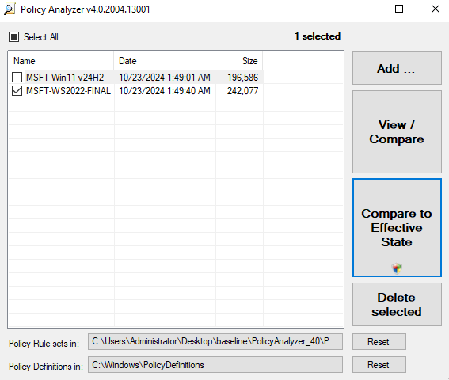
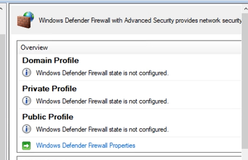
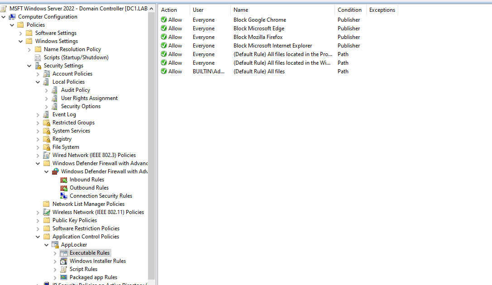
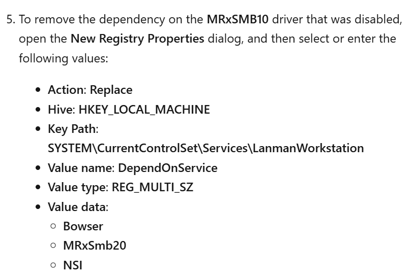
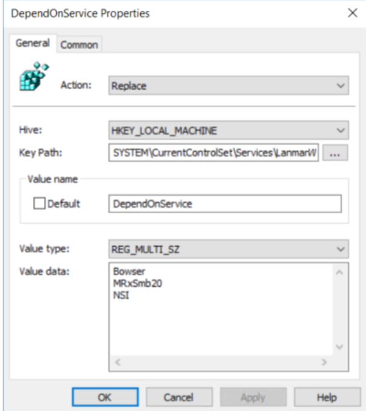
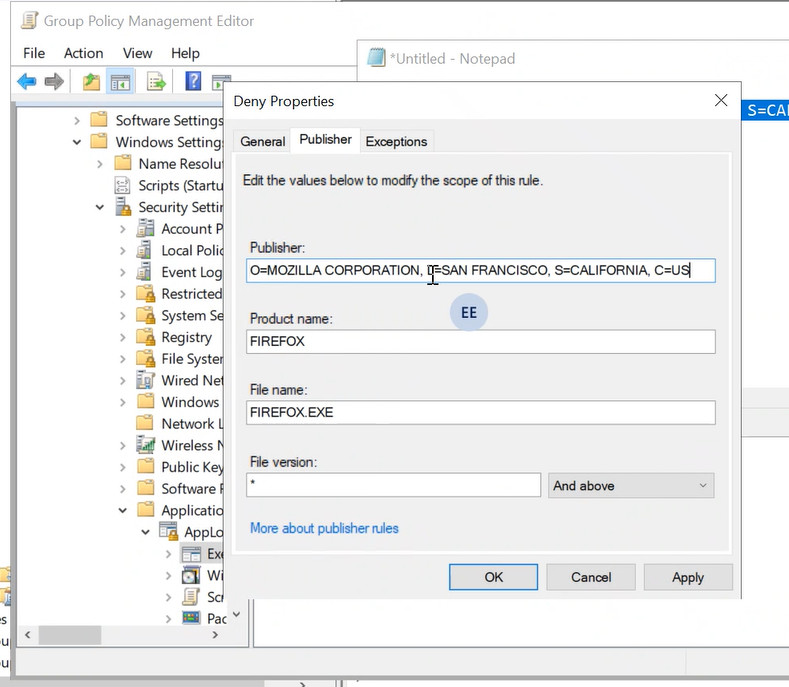
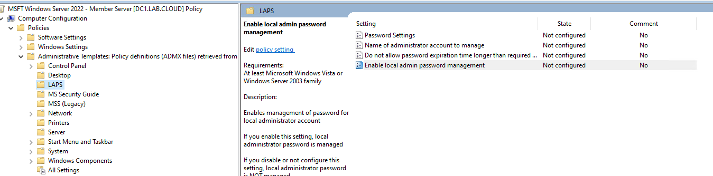
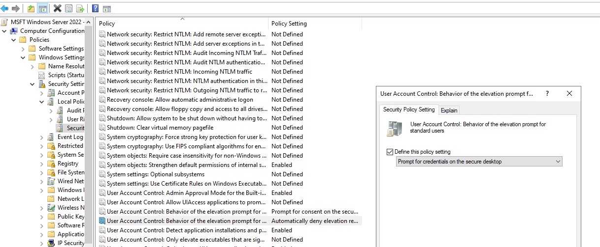
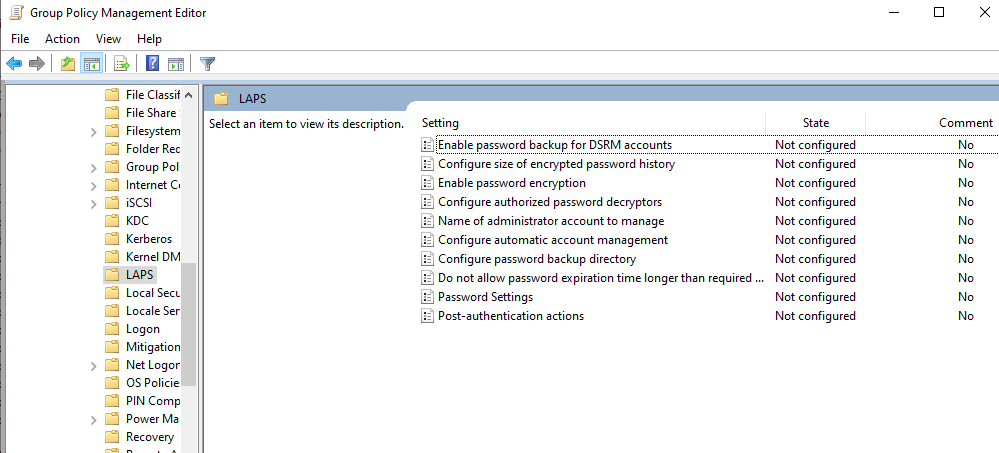

1. Update ADMX:
	1. Download latest version from [Link](https://learn.microsoft.com/en-us/troubleshoot/windows-client/group-policy/create-and-manage-central-store)
	2. Install and locate file on `C:\Program Files (x86)\Microsoft Group Policy`
	3. Open Policy Definition folder and remove all languages except `en-us` 
	4. Copy Policy Definition folder to `C:\Windows\SYSVOL\sysvol\<your_domain>\Policies` (central store).
	5. Replace all files
2. Download Baseline files from [Link](https://www.microsoft.com/en-us/download/details.aspx?id=55319) , these files:
	1. PolicyAnalyzer.zip
	2. Windows Server 2022 Security Baseline.zip
	3. Windows 11 v24H2 Security Baseline.zip (or latest version)
3. Navigate to `Windows Server-2022-Security-Baseline-FINAL\Templates` and copy all files to Policy Definition folder
4. Navigate to `\PolicyAnalyzer_40\Policy Rules` and delete all files.
5. Navigate to `\Windows Server-2022-Security-Baseline-FINAL\Documentation` and copy `MSFT-WS2022-FINAL.PolicyRules` to `\PolicyAnalyzer_40\Policy Rules`.
6. Navigate to `\Windows 11 v24H2 Security Baseline\Documentation` and copy `MSFT-Win11-v24H2.PolicyRules` to `\PolicyAnalyzer_40\Policy Rules`.
7. Now run PolicyAnalyzer as admin and reset policy rule location to `\PolicyAnalyzer_40\Policy Rules`
8. The rules we put in rules folder will appear, choose one and click `Compare To Effictive State` :
   
9. This will generate report showing the deference between baseline GPO and current GPO.
10. Ensure settings you want to apply and edit on baseline GPO.
11. Open PowerShell as admin on`Windows Server-2022-Security-Baseline-FINAL\Scripts`
12. Import baseline modules:
 ```powershell 
	 Set-ExecutionPolicy -Scope Process Unrestricted
	 .\Baseline-ADImport.ps1
	 r
	 r
```
13. On the same PowerShell session navigate to`\Windows 11 v24H2 Security Baseline\Scripts` and import baseline policy:
```powershell
.\Baseline-ADImport.ps1
	 r
	 r
```
1. Edit conflict settings on baseline.
2.  Disable these settings **(DC)**:
	1. LDAP signing & channel binding. 
	2. NTLM return to default value: `Send NTLMv2 response only` 
	3. Windows Defender Firewall change to not configure (Always check the status with gpresult)  
	4. Deny browsers (allow all)
	5. For **Windows 7** create new [GPO](https://learn.microsoft.com/en-us/windows-server/storage/file-server/troubleshoot/detect-enable-and-disable-smbv1-v2-v3?tabs=client#use-group-policy-to-disable-smbv1))to remove dependencies on SMBv1:   

 ```
SELECT * FROM Win32_OperatingSystem WHERE (Version LIKE "6.0%" OR Version LIKE "6.1%") AND ProductType <> 2
 ```

Change Firefox signature for AppLocker to the new one:
```
O=MOZILLA CORPORATION, L=SAN FRANCISCO, S=CALIFORNIA, C=US
```



3. Disable these settings **(Member Server)**:
	1. NTLM return to default value: `Send NTLMv2 response only`
	2. Windows Defender Firewall change to not configure (Always check the status with gpresult)  
	3. Legacy LAPS setting (off)
	4. UAC  (Behavior of the elevation prompt for standard users)
4. Disable these settings **(Computers)**:
	1. Windows Defender Firewall change to not configure (Always check the status with gpresult)  
	2. Windows LAPS setting 
	3. UAC  (Behavior of the elevation prompt for standard users)
