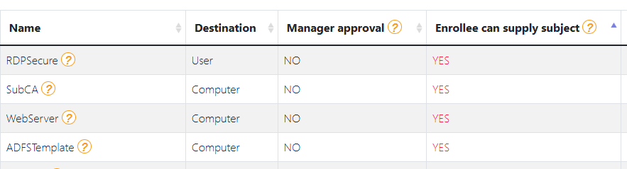
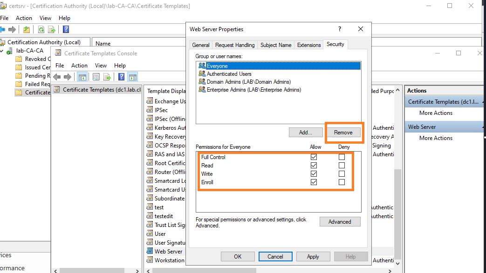

| Name                |
| ------------------- |
| Machine             |
| EFS                 |
| RemoteDesktopSecure |
| RDPSecure           |

The purpose of this rule is to ensure that there is no certificate template that can be edited by anyone.

**Advised solution:**
Review the security permissions of this certificate template and remove the write access to everyone-like groups such as Domain Users, Domain Computers, Everyone, Authenticated Users.

1. Open `Certificate Authority` and Navigate to `Certificate Templates` and click `Manage`
2. locate the vuln template then  `Properties > Security` and remove unneeded permission 

