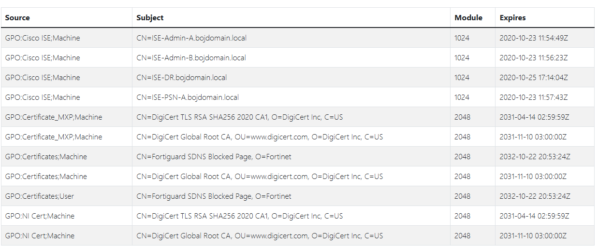

The purpose is to ensure that there is no use of a certificate using a relatively weak RSA key

**Technical explanation:**

A RSA key certificate with a modulus under 1024 bits is considered as not safe. This is checked by the rule A-WeakRSARootCert.  
This rule checks for certificates having a key under 2048 bits which is considered as having a lower level of security and under 3072 bits for certificates valid after 2030.
so the attacker can break the password
**Advised solution:**

To solve the matter, the certificate should be removed from the GPO and if needed, certificates depending on it should be reissued.

issue new cert with  3072 bits
