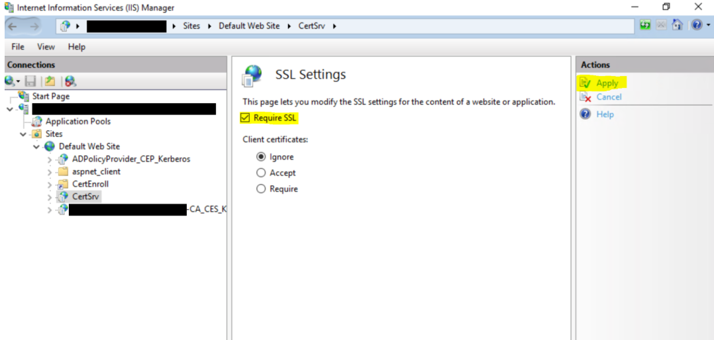
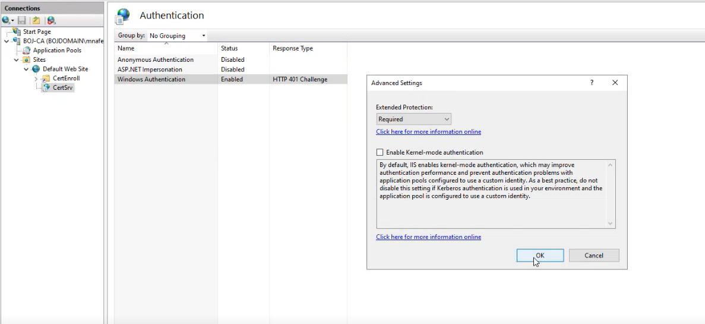
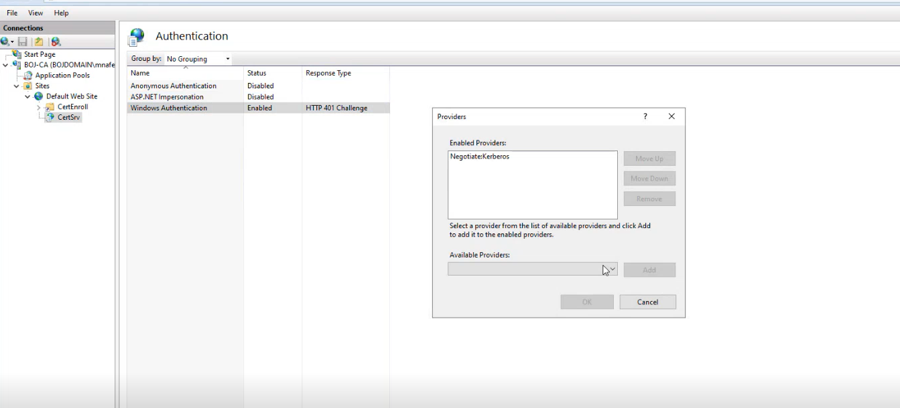

The purpose is to check if HTTP can be used to access the certificate enrollment interface.

[KB5005413: Mitigating NTLM Relay Attacks on Active Directory Certificate Services (AD CS) - Microsoft Support](https://support.microsoft.com/en-us/topic/kb5005413-mitigating-ntlm-relay-attacks-on-active-directory-certificate-services-ad-cs-3612b773-4043-4aa9-b23d-b87910cd3429)

open IIS manager an navigate to `CA\Sites\Default Web Site\CertSrv`

Enable **Require SSL**, which will enable only HTTPS connections.

