Microsoft LAPS can be used to manage local administrator passwords on your domain-joined devices. LAPS (Local Administrator Password Solution), creates a unique and random password for each device client in your network and stored the password in the Active Directory.

The advantage of Microsoft LAPS is that only users with the correct permissions can access the passwords and the local administrator account. And more importantly, attackers won’t be able to access and infect other computers when one account is compromised.


Laps checks expiration time if the time reached it will change the password and sends it to AD, if it can't reach AD the password will not change that's mean if the machine gone to be offline from the domain , LAPS password will not change
password changes through GPO update so if client doesn't see DC then there is no GPO update and no password change

##### Steps
###### Installing Microsoft LAPS
1. Download LAPS from  [Microsoft Download Center](https://www.microsoft.com/en-us/download/details.aspx?id=46899).
   - LAPS.x64.msi
   - LAPS_OperationssGuide.docx
2. Install LAPS:
   - Fat client UI         
   - PowerShell module 
   - Group Policy Editor admin template
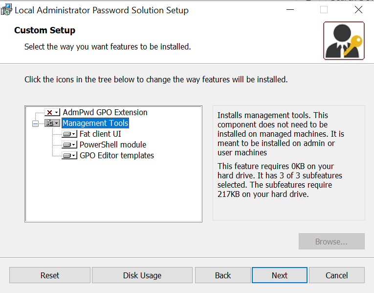

###### Update Active Directory Schema
Microsoft LAPS uses two new attributes in computer objects.  
1. **ms-Mcs-AdmPwd** – Save the administrator password in clear text  
2. **ms-Mcs-AdmPwdExpirationTime** – Save the timestamp of password expiration.
To update schema you need:
- Schema Admin.
- Schema Master
```powershell
#to know which DC is schema master
netdom query fsmo
```
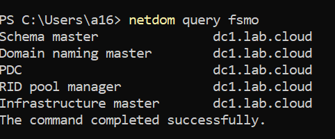

Update schema:
```powershell
   #to add laps attributes
   Import-module AdmPwd.PS
   Update-AdmPwdADSchema
 ```
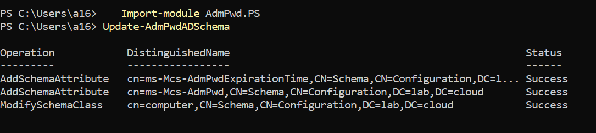
After schema update, we can see these two new attributes in the computer object:
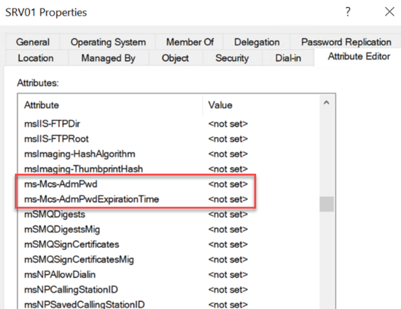

###### Change Computer object permissions
During the password update process, the computer object itself should have permission to write values to `ms-Mcs-AdmPwd` and `ms-Mcs-AdmPwdExpirationTime` attributes. To do that we need to grant permissions to `SELF` built-in account.


```powershell
 computers to change their passwords:
Set-AdmPwdComputerSelfPermission -OrgUnit  <OU>
```

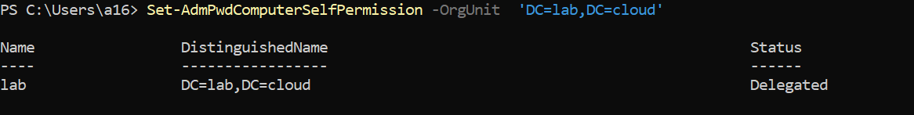

**Note**: The permission should be delegated to the OU which contains all machines, here we delegated to the domain OU and we will exclude DCs from LAPS policy.

###### Assign permissions to the group for password access

```powershell
 permision to reads local admin pass from AD
Set-AdmPwdReadPasswordPermission -OrgUnit "<name of the OU to delegate permissions>" -AllowedPrincipals <your_domain\users or groups>
 permision to reset local admin pass 
Set-AdmPwdResetPasswordPermission -OrgUnit "<name of the OU to delegate permissions>" -AllowedPrincipals <your_domain\users or groups>
```

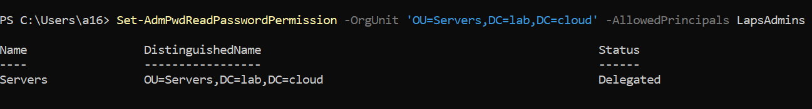

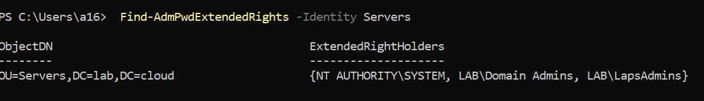

###### Create central store
Copy `Policy Definition` folder from `C:\Windows\PolicyDefinitions`to `C:\Windows\SYSVOL\sysvol\<your_domain>\Policies`. 

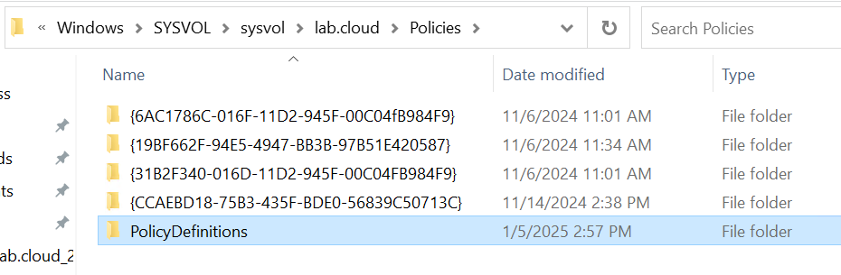


##### LAPS GPO
###### Configure LAPS Group Policies 
Create new GPO named LAPS and configure this  settings:
Edit and navigate to `Computer Configuration > Policies> Administrative Tampletes > LAPS` Configure this settings:
	1. Password Setting:
		1. Password Length: Set to Enabled and specify the length (14).
		2. Password Age (Days): Set to Enabled and specify the age (30 days).
	2. Name of Administrator Account to Manage: Set Enable and Specify the name of the admin account (ladmin ). 
	3. Do not allow password expiration time longer than required by policy: Set Enable.
	4. Enable Local Admin Password Management: Set to Enabled.

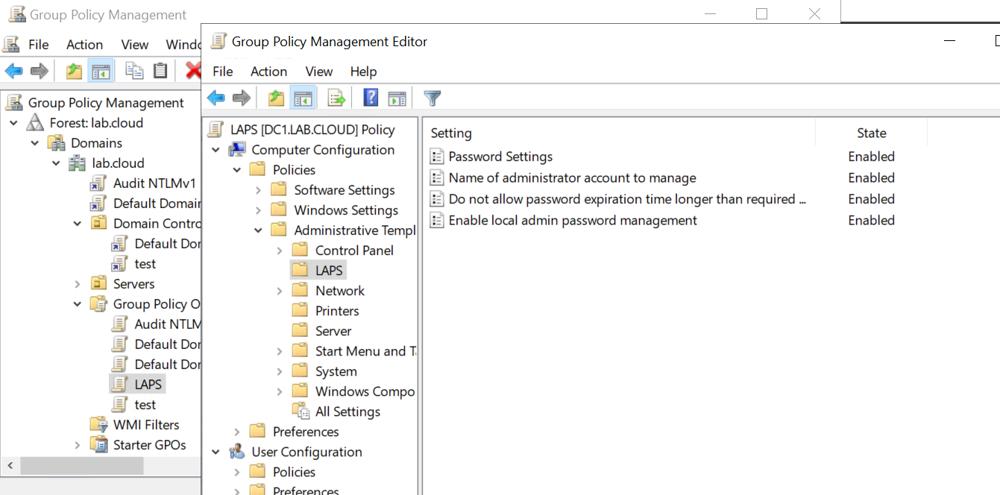

###### Create local admin in all machines
Open notepad as Administrator and write this script to it and save as `ps1`
```powershell
$admin = "ladmin"
$op = Get-LocalUser | where-Object Name -eq $admin | Measure
if ($op.Count -eq 0) { 
$password = ConvertTo-SecureString "P@ssw0rd@1411P@ssw0rd" -AsPlainText -Force
New-LocalUser -Name $admin -Password $password -FullName "adminuser" -Description "Local Admin For LAPS"
Add-LocalGroupMember -Name 'Administrators' -Member $admin}
```

Move the script file to your `Netlogon` folder `\\contoso.local\netlogon`

Edit GPO to add startup script:
	1. Navigate to: `Computer Configuration > Policies> Windows settings >Scripts > statup >PowerShell Scripts` then show files.
	2. Add and navigate to script loaction

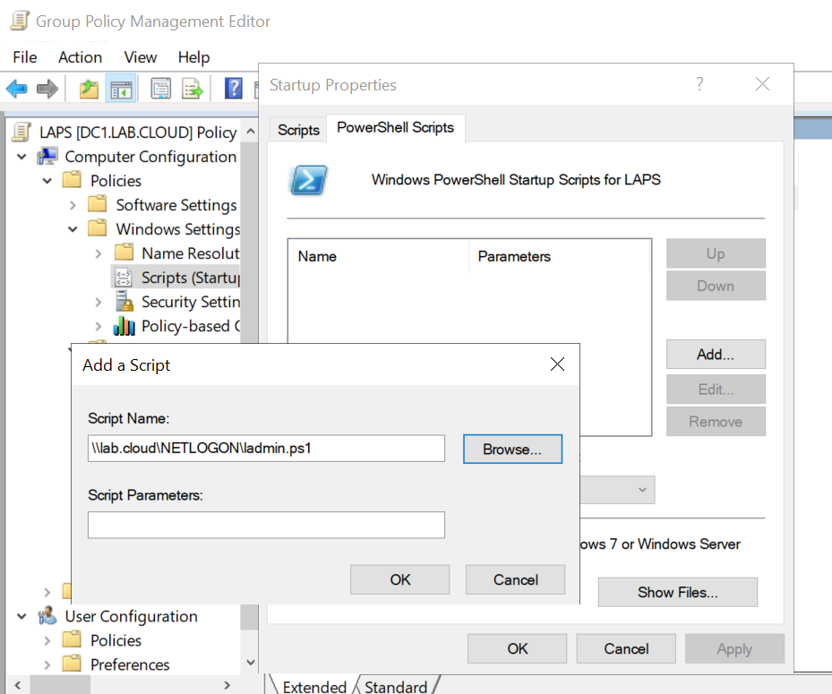


###### Install LAPS to all machines

Copy the `LAPS.x64.msi` file to your `Netlogon` folder `\\contoso.local\netlogon`

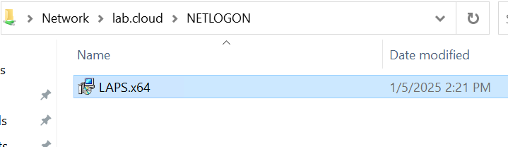

Edit GPO  to add LAPS file:
	Navigate to: `Computer Configuration > Policies> Software settings> Softwar inistallation ` then right-click `New > package > netlogin\LAPS.msi > assigned `
	
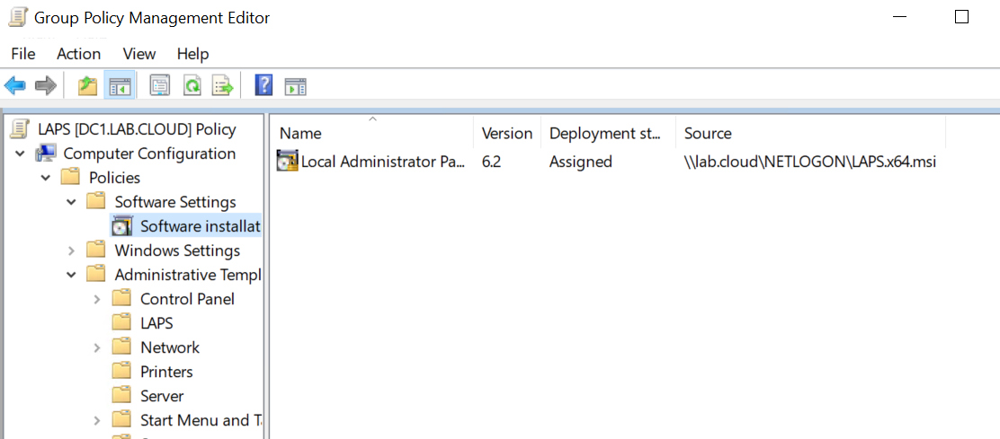

 For Help Desk  you can publish the package to appear in user control panel by using this:
		1. `Default domain policy > User Configuration > Policies> Software settings> Softwar inistallation ` then `New > package > netlogin\LAPS.msi > published` 
		2. user will see package on: `Control panel > larg icons > Programs and features > Install program from network` 
###### Exclude DCs from LAPS policy
Create new WMI filter:
	Open `Group Policy Management > WMI` then right-click on `New` then click `Add` and add this query: `Select * from Win32_ComputerSystem where DomainRole < 4`

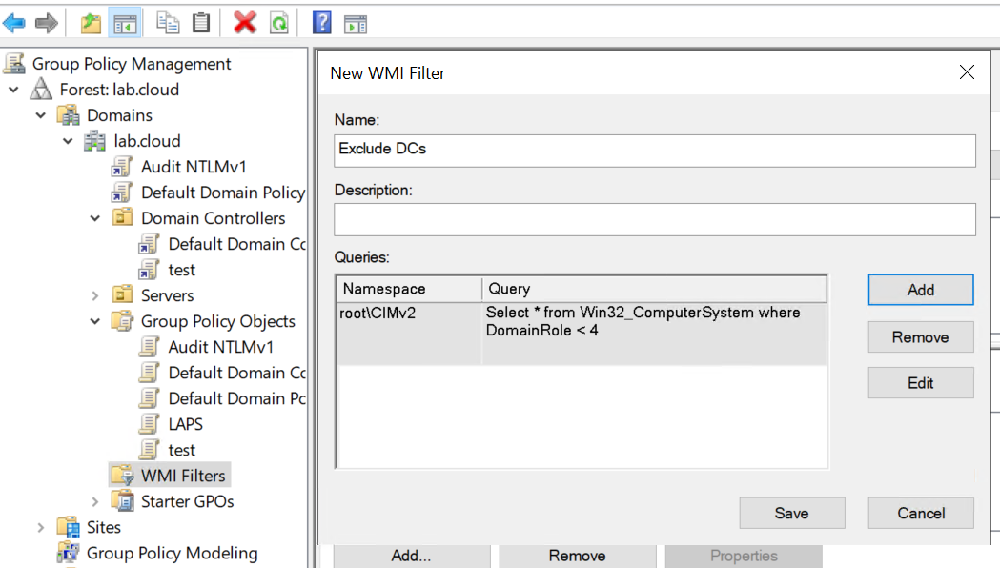
 
Add this WMI filter to LAPS GPO:
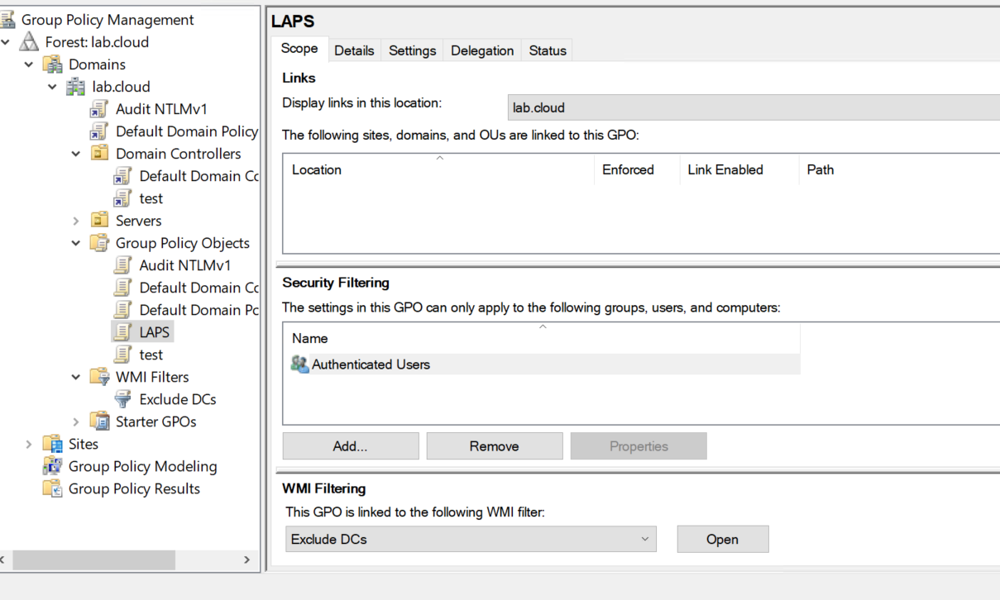


##### Troubleshooting 
Set `Always wait for the network at computer startup and logon` setting from `Default Domain Policy` to `Enable` :
Navigate to `Computer Configuration > Policies > Administrative Templates > System > Logon`

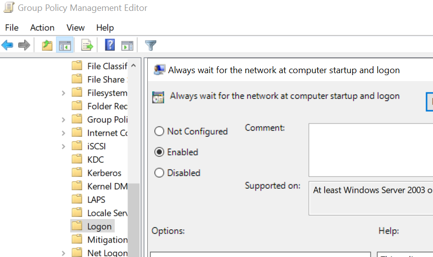

Get all machines with no LAPS:
```powershell
Get-ADComputer -Filter * -Properties MS-Mcs-AdmPwd | Where-Object MS-Mcs-AdmPwd -eq $null | FT Name,MS-Mcs-AdmPwd
```

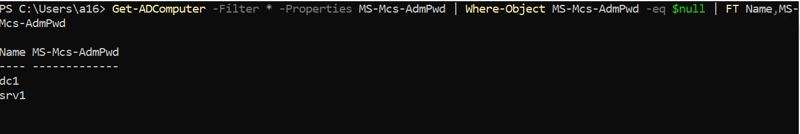

Check if `ladmin` user is created from local users and groups:

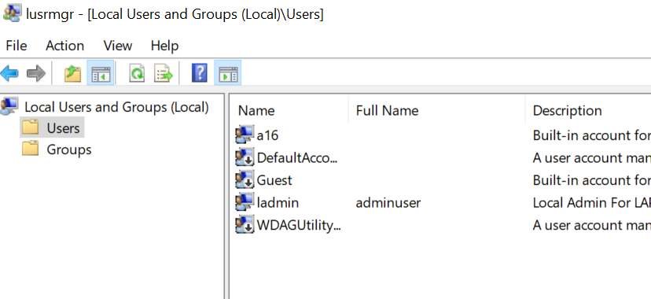

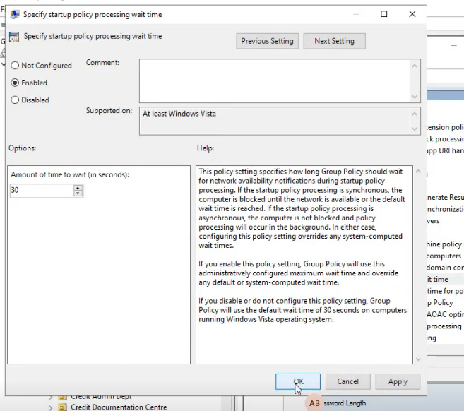
