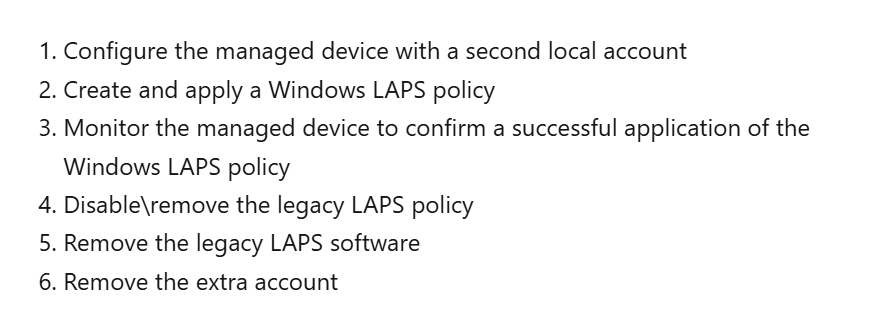

Migration Scenario by [Microsoft](https://learn.microsoft.com/en-us/windows-server/identity/laps/laps-scenarios-deployment-migration#transient-side-by-side-coexistence-approach):



1. Deploy win laps and ensure it works will and confirm with our new reg key
2. if the reg key exist, uninstall legacy msi (and this will delete legacy dll) and delete legacy account
3. wmi filter to apply legacy gpo if the legacy dll exist only
```sql
Select * From CIM_Datafile Where Name = 'C:\\Program Files\\LAPS\\CSE\\AdmPwd.dll'
```
#### Migration Script
```Powershell
# Define variables
$ManagedAccountName = "wladmin"
$KeyPath = "HKLM:\Software\gbg-laps"
$ValueName = "succes"; $ValueData = "true"
$NewValueName = "Pass"; $NewValueData = 1
$LegacyAccountName = "ladmin"
$programName = "Local Administrator Password Solution"
# Check if the local user exists, create if not
if ((Get-LocalUser | Where-Object Name -eq $ManagedAccountName | Measure).Count -eq 0) {
    Add-Type -AssemblyName System.Web -ErrorAction SilentlyContinue
    $password = [System.Web.Security.Membership]::GeneratePassword(12, 2) | ConvertTo-SecureString -AsPlainText -Force
    New-LocalUser -Name $ManagedAccountName -Password $password -FullName "adminuser" -Description "Local Admin For Windows LAPS" -ErrorAction SilentlyContinue | Out-Null
    Add-LocalGroupMember -Name 'Administrators' -Member $ManagedAccountName -ErrorAction SilentlyContinue | Out-Null
  Reset-LapsPassword -ErrorAction SilentlyContinue | Out-Null
    Start-Sleep -Milliseconds 500
}

# Handle registry key and properties
if (-not (Test-Path -Path $KeyPath)) {
    if ((Get-WinEvent -LogName 'Microsoft-Windows-LAPS/Operational' | Where-Object {$_.id -eq 10020} -ErrorAction SilentlyContinue).Count -ge 1) {
        New-Item -Path $KeyPath -Force -ErrorAction SilentlyContinue | Out-Null
        New-ItemProperty -Path $KeyPath -Name $ValueName -Value $ValueData -Force -ErrorAction SilentlyContinue | Out-Null
        New-ItemProperty -Path $KeyPath -Name $NewValueName -Value $NewValueData -Force -ErrorAction SilentlyContinue | Out-Null
    }

} elseif ((Get-ItemProperty -Path $KeyPath -Name $NewValueName -ErrorAction SilentlyContinue).$NewValueName -eq 1) {

    # Uninstall program if exists
    $program = Get-CimInstance -ClassName Win32_Product -Filter "Name = '$programName'" -ErrorAction SilentlyContinue
    if ($program) {
        $uninstallString = $program.IdentifyingNumber
        if ($uninstallString) {
            Start-Process -FilePath "msiexec.exe" -ArgumentList "/x $uninstallString /quiet /norestart" -Wait -NoNewWindow
        }
    }
  
    # Remove legacy account if exists
    if (Get-LocalUser -Name $LegacyAccountName -ErrorAction SilentlyContinue) {
        Remove-LocalUser -Name $LegacyAccountName -ErrorAction SilentlyContinue | Out-Null
    }
#Disable legacy account if exist and remove from admin group
#if (Get-LocalUser -Name $LegacyAccountName -ErrorAction SilentlyContinue) {
    #Disable-LocalUser -Name $LegacyAccountName -ErrorAction SilentlyContinue | Out-Null
   # Remove-LocalGroupMember -Group "Administrators" -Member $LegacyAccountName -ErrorAction SilentlyContinue | Out-Null
#}


    # Update registry value
    Set-ItemProperty -Path $KeyPath -Name $NewValueName -Value 0 -Force -ErrorAction SilentlyContinue | Out-Null
}
```
