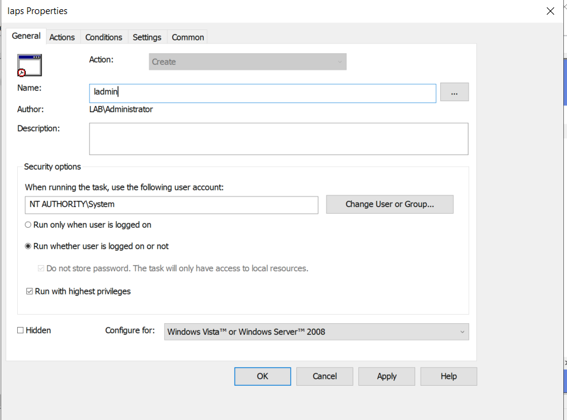
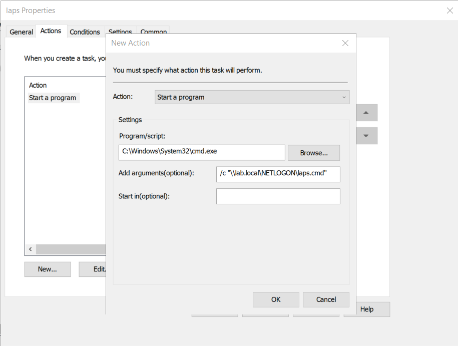

gpupdate 3 times

Edit GPO to add Scheduled Task:
1. Navigate to `Computer Configuration > Preferences > Control Panel Settings > Scheduled Tasks` 
2. Right click and select `Immediate Task (At least Windows 7)`
3. In General tab:
	1. Name: `ladmin`
	2. Select `NT AUTHORITY\System` to run and select `Run with highest privileges`.
4. In Action tab click `New` and select:
	1. Program/script: `C:\Windows\System32\cmd.exe`
	2. Arguments: `/c "\\lab.local\NETLOGON\laps.cmd"` 


```cmd
@echo off
setlocal EnableExtensions EnableDelayedExpansion

:: --- Generate random password -----------------
set "chars=ABCDEFGHIJKLMNOPQRSTUVWXYZabcdefghijklmnopqrstuvwxyz0123456789!@#$%^&*"
set "length=12"
set "password="

for /L %%i in (1,1,%length%) do (
set /a "rand=!RANDOM! %% 72"
for %%j in (!rand!) do (
set "password=!password!!chars:~%%j,1!"
)
)

:: --- Add local admin account if it doesn't exist -----------------
set "admin=ladmin"

net user "%admin%" >nul 2>&1
if errorlevel 1 (
echo Y| net user "%admin%" "%password%" /add /fullname:"adminuser" /comment:"Local Admin For LAPS"
echo Y| net localgroup Administrators "%admin%" /add
)
timeout /t 5 >nul

:: --- Create registry marker after LAPS Event ID 10020 ------------
set "KeyPath=HKLM\SOFTWARE\gbg-laps"
set "RegView="
if /i "%PROCESSOR_ARCHITECTURE%"=="AMD64" set "RegView=/reg:64"
reg query "%KeyPath%" %RegView% >nul 2>&1 && goto :EOF
for /f "usebackq delims=" %%A in (`
    wevtutil qe "Microsoft-Windows-LAPS/Operational" ^
        /q:"*[System[(EventID=10020)]]" /c:1 /f:text 2^>nul
`) do goto :HasEvent

goto :EOF

:HasEvent
reg add "%KeyPath%" %RegView% /f >nul
reg add "%KeyPath%" %RegView% /v "succes" /t REG_SZ /d "true" /f >nul

:EOF
endlocal
exit /b 0
```




