Windows LAPS is a Windows feature that allows you to automatically set and backup local administrator passwords of your domain-joined devices. LAPS (Local Administrator Password Solution), creates a unique and random password for each device in your network and stores it in the Active Directory or Azure Active Directory.


###### Windows LAPS requirements

Windows LAPS is available on the following OS platforms with the specified update or later installed:
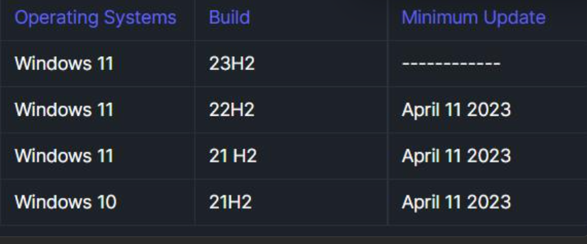

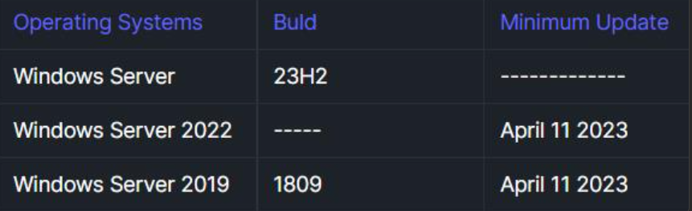

[Windows LAPS overview | Microsoft Learn](https://learn.microsoft.com/en-us/windows-server/identity/laps/laps-overview#windows-laps-supported-platforms)

##### Steps

**Update ADMX:**
	1. Download latest version from [Link](https://learn.microsoft.com/en-us/troubleshoot/windows-client/group-policy/create-and-manage-central-store)
	2. Install and locate file on `C:\Program Files (x86)\Microsoft Group Policy`
	3. Open Policy Definition folder and remove all languages except `en-us` 
	4. Copy Policy Definition folder to `C:\Windows\SYSVOL\sysvol\<your_domain>\Policies` (central store).
	5. Replace all files.


 **Create central store**
[Create and manage Central Store - Windows Client | Microsoft Learn](https://learn.microsoft.com/en-us/troubleshoot/windows-client/group-policy/create-and-manage-central-store)

install and locate file on `C:\Program Files (x86)\Microsoft Group Policy`

 Open Policy Definition folder and remove all languages except `en-us` 
 
Copy `Policy Definition` folder from `C:\Windows\PolicyDefinitions`to `C:\Windows\SYSVOL\sysvol\<your_domain>\Policies`.  --> override the existed files don't delete.


 **Extend AD Schema**
To update schema you need:
- Schema Admin. --> if not, u can add admin account to schema admins group and log-off then log-in again
- Schema Master --> not required 
```powershell
#to know which DC is schema master
netdom query fsmo
```


Update schema:
```powershell
   #to add laps attributes
   Update-LapsADSchema
   #to verify 
   Update-LapsAdSchema -Verbose
 ```
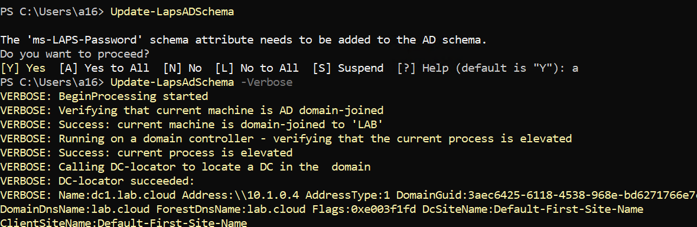

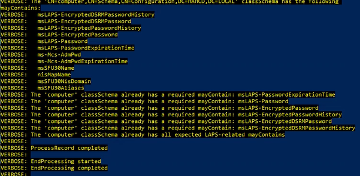


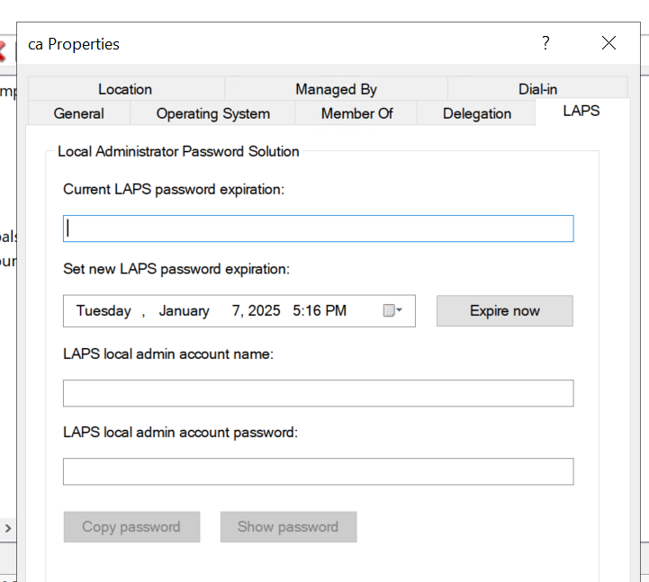

###### Step 2 – Set Permissions

Set Computer Self Permissions:

```powershell
 computers to change their passwords:
Set-LapsADComputerSelfPermission -Identity  <OU>
```

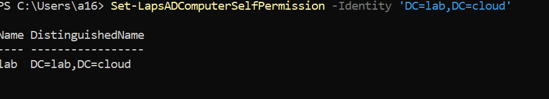

**Note**: The permission should be delegated to the OU which contains all machines, here we delegated to the domain OU and we will exclude DCs from LAPS policy.

Assign permissions to the group for password access:

```powershell
 permision to reads local admin pass from AD
Set-LapsADReadPasswordPermission -Identity "DN of the OU to delegate permissions" -AllowedPrincipals 'lab.local\group'
 permision to reset local admin pass 
Set-LapsADResetPasswordPermission -Identity "DN of the OU to delegate permissions" -AllowedPrincipals 'lab.local\group'
```

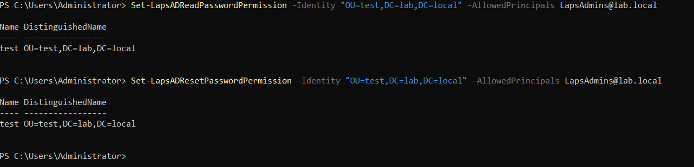


##### LAPS GPO
###### Configure LAPS Group Policies
Create new GPO named LAPS and configure this  settings:
Edit and navigate to `Computer Configuration > Policies> Administrative Tampletes > System> LAPS` Configure this settings:
	1. Name of administrator account to manage: Set Enable and Specify the name of the admin account (ladmin ). 
	2. Configure password backup directory: Set Enable and chose Active Directory.
	3. Do not allow password expiration time longer than required by policy: Set Enable.
	4. Password Setting Set to Enabled and specify:
		1. Password Length:  length (14).
		2. Password Age (Days):  (30 days).
	5. Post-authentication actions: Set Enable and specify:
		1. Grace period: 24h .
		2. Actions: Reset the password and logoff the managed account.
		3. Note: `Reset password and sign out` option works only from OS (win11 24h2).

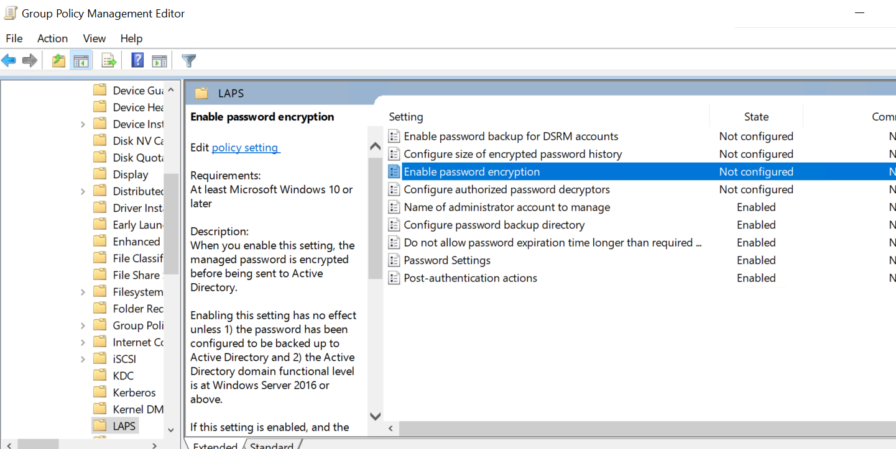


###### Create local admin in all machines
Open notepad as Administrator and write this script to it and save as `ps1`

```powershell
$admin = "ladmin"
$op = Get-LocalUser | where-Object Name -eq $admin | Measure
if ($op.Count -eq 0) { 
# if user not exist - create it
Add-Type -AssemblyName System.Web 
$password = [System.Web.Security.Membership]::GeneratePassword(12, 2) | ConvertTo-SecureString -AsPlainText -Force
New-LocalUser -Name $admin -Password $password -FullName "adminuser" -Description "Local Admin For LAPS"
# add to local admins
Add-LocalGroupMember -Name 'Administrators' -Member $admin
Reset-LapsPassword # LAPS will reset the password
start-sleep 5
}

 
$KeyPath = "HKLM:\Software\gbg-laps"
$ValueName = "succes"  
$ValueData = "true"  
if (Test-Path -Path $KeyPath) {
     "Registry key $KeyPath exists"
} else {
     "Registry key $KeyPath does not exist"
    if ((Get-WinEvent -LogName 'Microsoft-Windows-LAPS/Operational' | Where-Object {$_.id -eq 10020}).count -ge 1 ) {
       New-Item -Path $KeyPath -Force  
       New-ItemProperty -Path $KeyPath -Name $ValueName -Value $ValueData -Force  
    }
}
```

[Win-LAPS with cmd]()


Move the script file to your `Netlogon` folder `\\contoso.local\netlogon`

Edit GPO to add Scheduled Task:
1. Navigate to `Computer Configuration > Preferences > Control Panel Settings > Scheduled Tasks` 
2. Right click and select `Immediate Task (At least Windows 7)`
3. In General tab:
	1. Name: `ladmin`
	2. Select `NT AUTHORITY\System` to run and select `Run with highest privileges`.
4. In Action tab click `New` and select:
	1. Program/script: `C:\WINDOWS\system32\WindowsPowerShell\v1.0\powershell.exe`
	2. Arguments: `-ExecutionPolicy Bypass -command "& \\lab.local\NETLOGON\ladmin.ps1"` 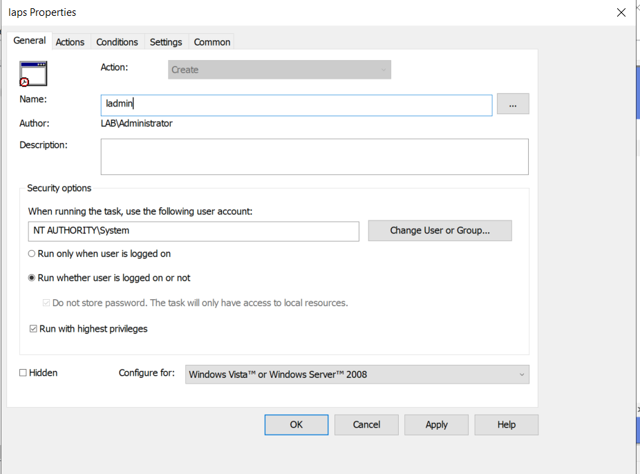 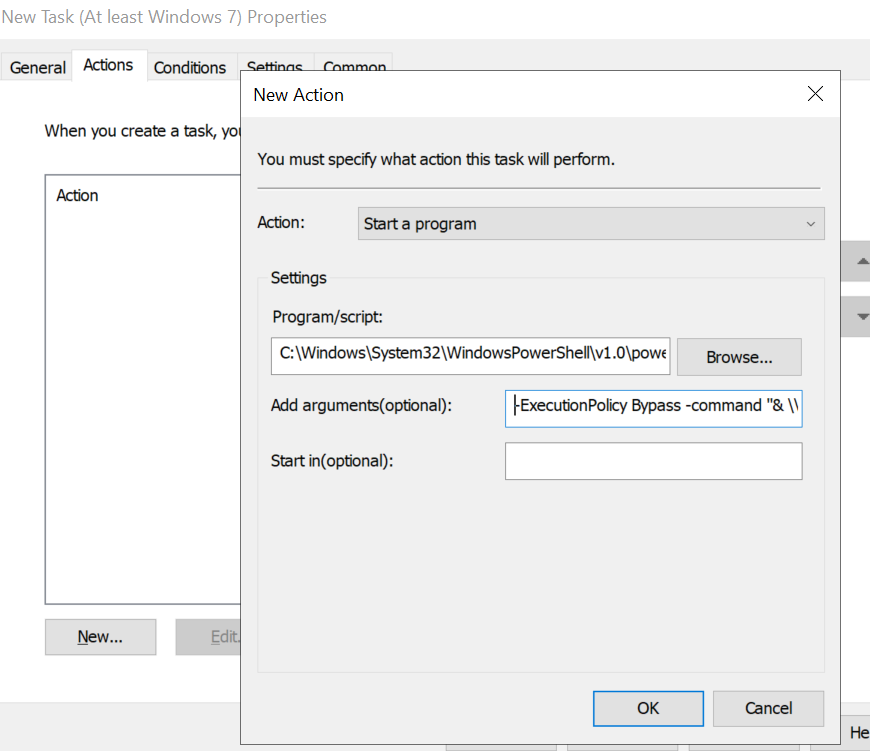
5. Remove local users if laps is applied:
	1. Navigate to `Computer Configuration > Preferences > Control Panel Settings > Local Users and Groups` 
	2.  Let Action to `Update`,Right click then `New > Local Group`
	3. From `Group Name` select `Administrators (built-in)`.
	4. checkbox on `Delete all members users` and `Delete all members groups`.
	5. Click `Add` and add LAPS admin `ladmin` , `Domain Admins` and built-in administrator`Administrator`   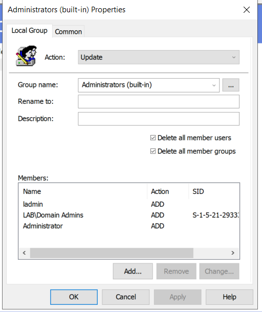   
  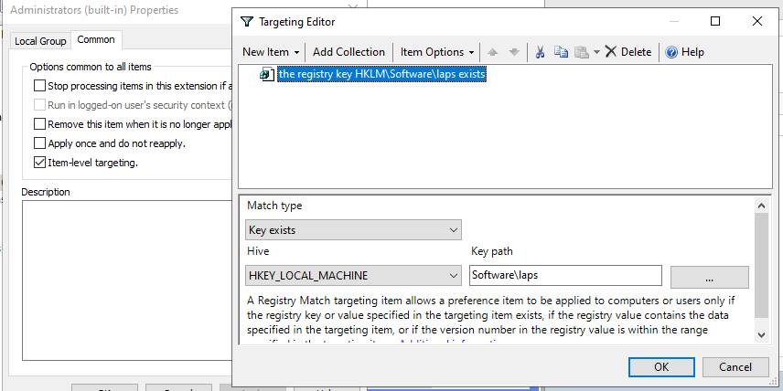   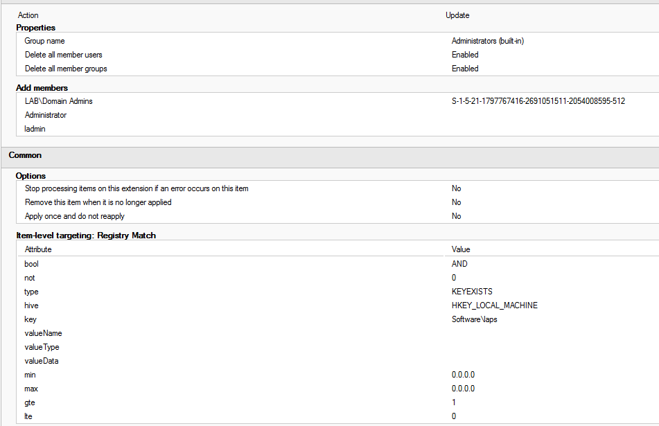


###### Exclude DCs and Non supported OS from LAPS policy

Create new WMI filter:
	Open `Group Policy Management > WMI` then right-click on `New` then click `Add` and add this query: 
```sql
Select * from Win32_ComputerSystem where DomainRole <> 5 AND DomainRole <> 4
```
   Add query to exclude non-supported OS:
```sql
Select * From CIM_Datafile Where Name = 'c:\\windows\\System32\\laps.dll'
```
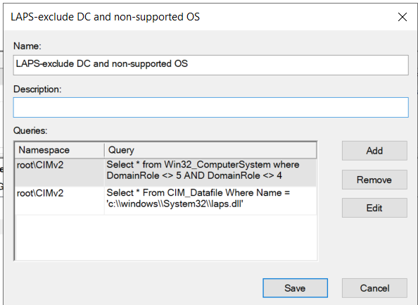

Add this WMI filter to LAPS GPO:
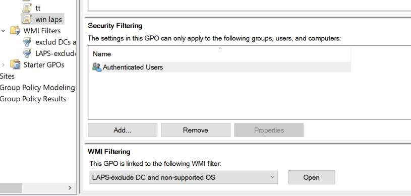

Link the GPO to computers OU

Update RSAT tools:
```powershell
Get-WindowsCapability -Name Rsat.ActiveDirectory.DS-LDS.Tools* -Online | Add-WindowsCapability –Online
```
##### Disable local admins GPO
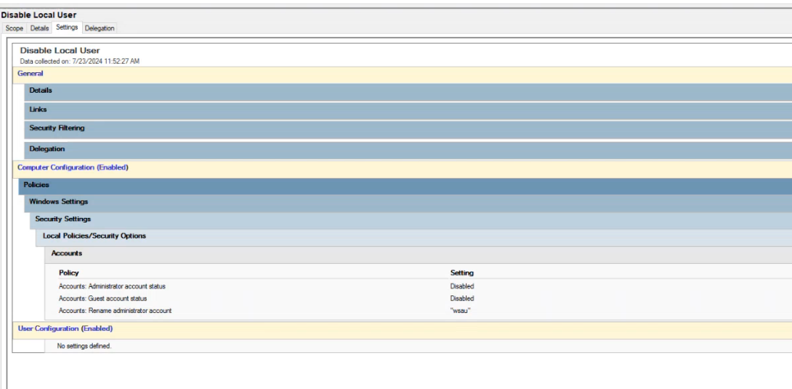
**Resources:**
[Windows LAPS and the migration from Microsoft LAPS - InfrastructureHeroes.org](https://www.infrastructureheroes.org/microsoft-infrastructure/active-directory/windows-laps-and-the-migration-from-microsoft-laps/)
[Configure Windows LAPS step by step - ALI TAJRAN](https://www.alitajran.com/windows-laps/#h-windows-laps-requirements)
https://lazyadmin.nl/it/windows-laps/
[Windows LAPS overview | Microsoft Learn](https://learn.microsoft.com/en-us/windows-server/identity/laps/laps-overview)

###### Troubleshooting

find all events related to LAPS in the event viewer under **Applications and Services > Microsoft > Windows > LAPS**
[Windows LAPS troubleshooting guidance - Windows Server | Microsoft Learn](https://learn.microsoft.com/en-us/troubleshoot/windows-server/windows-security/windows-laps-troubleshooting-guidance)
[How to fix Windows LAPS account password decrypt permission error - ALI TAJRAN](https://www.alitajran.com/windows-laps-account-password-decrypt-permission-error/#h-step-1-create-a-security-group)


## list all computer joined by non-admin user  ^mS-DS-CreatorSID
```Powershell
Get-ADComputer -Filter {mS-DS-CreatorSID -like "*"} -Properties mS-DS-CreatorSID | Select-Object Name,@{Name="Creator";Expression={(New-Object System.Security.Principal.SecurityIdentifier($_.'mS-DS-CreatorSID')).Translate([System.Security.Principal.NTAccount]).Value}}
```

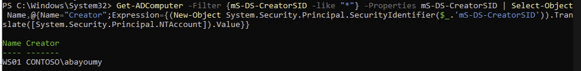
delete all permissions set to this User on target computer then user cannot get laps password.
Then customer have to  disjoin all effected computers, delete computer account , then rejoin with domain admin or delegated user, 'mS-DS-CreatorSID’ is read-only and cannot change.

```dataview
List
FROM (#laps) and !#moc 
SORT file.name ASC
```
