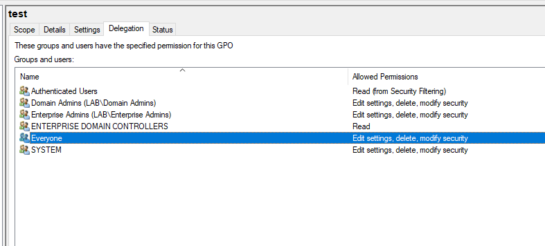

If you have access to a key server and the helpdesk can reset your password, then the helpdesk has access to the key server.

this rule can be seen if normal domain users have permission to a key OU or group or have permission on a GPO or machine have control on key OU or group.

we can see this misconfiguration in ping-castle control paths and review this permission on `security` tab for OU or on `Delegation` tab for GPO

