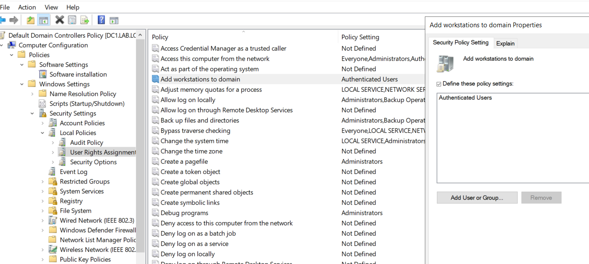

1. Open AD Users and Computers
2. Right-click on domain root  then `Propreties > Attribute Editor`
3. Change `ms-DS-MachineAccountQuota` value to `0`


Review joined machines and ensure that the owner is the domain admin:
1. Locate VM and right-click then `Propreties > Security > Advanced` 
2. Check VM owner
3. Check `Access` from `Permission entries` and ensure users who have `Full Control` or `Extended  rights` 

these permissions can get LAPS password
also
[cve]([Exploiting the CVE-2021-42278 (sAMAccountName spoofing) and CVE-2021-42287 (deceiving the KDC) Active Directory vulnerabilities – 4sysops](https://4sysops.com/archives/exploiting-the-cve-2021-42278-samaccountname-spoofing-and-cve-2021-42287-deceiving-the-kdc-active-directory-vulnerabilities/))  that makes machine owner to impersonate DC and gain TGT as DC then can request TGS for any service
```powershell
# Query Machine Account Quoata  
Get-ADObject -Identity (Get-ADDomain).DistinguishedName -Properties ms-DS-MachineAccountQuota | Select-Object ms-DS-MachineAccountQuota
```

```powershell 
# Set Machine Account Quota to 0    
Set-ADObject -Identity (Get-ADDomain).DistinguishedName -Replace @{ 'ms-DS-MachineAccountQuota' = 0 }
```




https://blog.backslasher.net/preventing-users-from-adding-computers-to-a-domain
