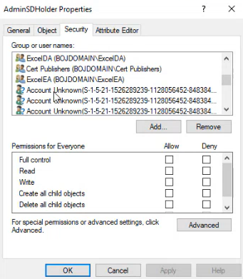
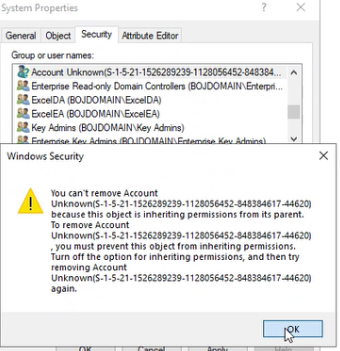

In the case where a delegation has been created, where the account can't be translated to a NT account, it means that the delegation is actually from another domain or that the user has been deleted.

To solve:
Go to the OU that have this delegation and check properties then Security tab and delete the unknown users

if you get this error , you have to remove this unknown account from the parent OU first.

| DN                                             | delegation                                    | right                                                                                                                                                                                                                                          |
| ---------------------------------------------- | --------------------------------------------- | ---------------------------------------------------------------------------------------------------------------------------------------------------------------------------------------------------------------------------------------------- |
| OU=Sphinx,DC=Orascom,DC=Local                  | S-1-5-21-97883781-1954776709-1662126773-6080  | GenericAll, GenericWrite, WriteDacl, WriteOwner, EXT_RIGHT_FORCE_CHANGE_PWD                                                                                                                                                                    |
| OU=Muriya,DC=Orascom,DC=Local                  | S-1-5-21-97883781-1954776709-1662126773-11981 | GenericAll, GenericWrite, WriteDacl, WriteOwner, EXT_RIGHT_FORCE_CHANGE_PWD                                                                                                                                                                    |
| OU=Unity Users,DC=Orascom,DC=Local             | S-1-5-21-97883781-1954776709-1662126773-6112  | EXT_RIGHT_FORCE_CHANGE_PWD                                                                                                                                                                                                                     |
| OU=Unity Users,DC=Orascom,DC=Local             | S-1-5-21-97883781-1954776709-1662126773-6114  | EXT_RIGHT_FORCE_CHANGE_PWD                                                                                                                                                                                                                     |
| OU=OrascomHC,DC=Orascom,DC=Local               | S-1-5-21-97883781-1954776709-1662126773-13854 | GenericAll, GenericWrite, WriteDacl, WriteOwner, All extended right, DSSelf, Write all prop, GenericAll, GenericWrite, WriteDacl, WriteOwner, GenericAll, GenericWrite, WriteDacl, WriteOwner                                                  |
| OU=OrascomHC,DC=Orascom,DC=Local               | S-1-5-21-97883781-1954776709-1662126773-8517  | GenericAll, GenericWrite, WriteDacl, WriteOwner, GenericAll, GenericWrite, WriteDacl, WriteOwner, GenericAll, GenericWrite, WriteDacl, WriteOwner                                                                                              |
| OU=OrascomHC,DC=Orascom,DC=Local               | S-1-5-21-97883781-1954776709-1662126773-9123  | GenericAll, GenericWrite, WriteDacl, WriteOwner, GenericAll, GenericWrite, WriteDacl, WriteOwner                                                                                                                                               |
| OU=Locations,OU=Unity,DC=Orascom,DC=Local      | S-1-5-21-97883781-1954776709-1662126773-6112  | GenericAll, GenericWrite, WriteDacl, WriteOwner                                                                                                                                                                                                |
| OU=Locations,OU=Unity,DC=Orascom,DC=Local      | S-1-5-21-97883781-1954776709-1662126773-6114  | GenericAll, GenericWrite, WriteDacl, WriteOwner                                                                                                                                                                                                |
| OU=Europe,DC=Orascom,DC=Local                  | S-1-5-21-97883781-1954776709-1662126773-11980 | GenericAll, GenericWrite, WriteDacl, WriteOwner, GenericWrite, GenericWrite, EXT_RIGHT_FORCE_CHANGE_PWD                                                                                                                                        |
| OU=CRM,DC=Orascom,DC=Local                     | S-1-5-21-97883781-1954776709-1662126773-11224 | GenericAll, GenericWrite, WriteDacl, WriteOwner, GenericAll, GenericWrite, WriteDacl, WriteOwner, GenericAll, GenericWrite, WriteDacl, WriteOwner                                                                                              |
| OU=CMR2,DC=Orascom,DC=Local                    | S-1-5-21-97883781-1954776709-1662126773-11224 | GenericAll, GenericWrite, WriteDacl, WriteOwner, GenericAll, GenericWrite, WriteDacl, WriteOwner                                                                                                                                               |
| OU=CRM-OHD,DC=Orascom,DC=Local                 | S-1-5-21-97883781-1954776709-1662126773-11224 | GenericAll, GenericWrite, WriteDacl, WriteOwner, All extended right, DSSelf, Write all prop, GenericAll, GenericWrite, WriteDacl, WriteOwner, GenericAll, GenericWrite, WriteDacl, WriteOwner, GenericAll, GenericWrite, WriteDacl, WriteOwner |
| CN=Users,DC=Orascom,DC=Local                   | S-1-5-21-97883781-1954776709-1662126773-6114  | EXT_RIGHT_FORCE_CHANGE_PWD                                                                                                                                                                                                                     |
| CN=Computers,DC=Orascom,DC=Local               | S-1-5-21-97883781-1954776709-1662126773-8100  | GenericAll, GenericWrite, WriteDacl, WriteOwner, All extended right, DSSelf, Write all prop                                                                                                                                                    |
| CN=System,DC=Orascom,DC=Local                  | S-1-5-21-97883781-1954776709-1662126773-5674  | GenericAll, GenericWrite, WriteDacl, WriteOwner, All extended right, DSSelf, Write all prop                                                                                                                                                    |
| CN=System,DC=Orascom,DC=Local                  | S-1-5-21-97883781-1954776709-1662126773-8713  | GenericAll, GenericWrite, WriteDacl, WriteOwner, All extended right, DSSelf, Write all prop                                                                                                                                                    |
| CN=System,DC=Orascom,DC=Local                  | S-1-5-21-97883781-1954776709-1662126773-8753  | GenericAll, GenericWrite, WriteDacl, WriteOwner, All extended right, DSSelf, Write all prop                                                                                                                                                    |
| CN=AdminSDHolder,CN=System,DC=Orascom,DC=Local | S-1-5-21-97883781-1954776709-1662126773-6114  | Write all prop                                                                                                                                                                                                                                 |
| DC=Orascom,DC=Local                            | S-1-5-21-97883781-1954776709-1662126773-11282 | GenericAll, GenericWrite, WriteDacl, WriteOwner                                                                                                                                                                                                |
