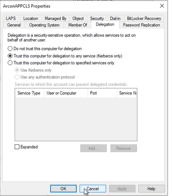

ArconAPPCLS.

| DN                                                                          | Name            |
| --------------------------------------------------------------------------- | --------------- |
| CN=BOJ-FISAPP,OU=Servers,OU=Jordan,DC=bojdomain,DC=local                    | BOJ-FISAPP$     |
| CN=BOJ-FISDB,OU=Servers,OU=Jordan,DC=bojdomain,DC=local                     | BOJ-FISDB$      |
| CN=WEBFORM-01-PRO,OU=ECM Servers,OU=Servers,OU=Jordan,DC=bojdomain,DC=local | WEBFORM-01-PRO$ |
| CN=JO-CSM-PROD,OU=Servers,OU=Jordan,DC=bojdomain,DC=local                   | JO-CSM-PROD$    |
|                                                                             | ArconAPPCLS$    |
The purpose is to ensure that no account can impersonate any account.

**Technical explanation:**

When an unconstrained delegation is configured, the Kerberos ticket TGT can be captured. This TGT grant then access to any service the user has access. If the user is an administrator or a domain controller (a connection can be forced using the spooler service), the domain can be compromised.

**Advised solution:**

Replace unconstrained delegation by constrained delegation. In practice, on the account object, tab "delegation", replace "trust this computer for delegation to any service" by "trust this computer for delegation to specified services only".


List all machines that configured to perform unconstrained delegation:
```powershell
Get-ADComputer -Filter {TrustedForDelegation -eq $True} -Property OperatingSystem , TrustedForDelegation, ServicePrincipalName
```


Here’s a quick PowerShell command that discovers accounts with Kerberos delegation (requires the AD PowerShell module):
```powershell
Get-ADObject -filter { (UserAccountControl -BAND 0x0080000) -OR (UserAccountControl -BAND 0x1000000) -OR (msDS-AllowedToDelegateTo -like '*') } -prop Name,ObjectClass,PrimaryGroupID,UserAccountControl,ServicePrincipalName,msDS-AllowedToDelegateTo
```
