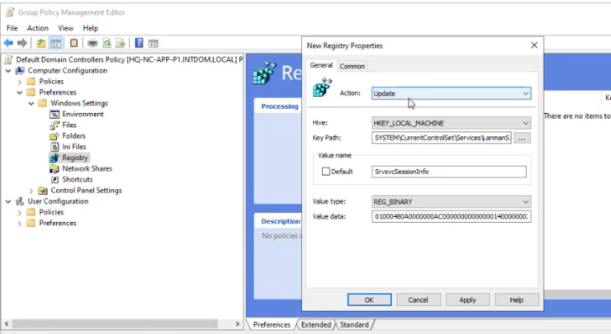

1. Open `Default Domain Policy > Edit`
2. Navigate to `Computer Configuration > Preferences > Windows Settings > Registry`
3. Right-click 1. `Registry > New > Registry Item`
4. Set `Action: Update` `Hive: HKEY_LOCAL_MACHINE` 
5. `Key Path: SYSTEM\CurrentControlSet\Services\LanmanServer\DefaultSecurity`
6. Select  `SrvsvcSessionInfo` then `Ok`

[Network session enumeration - Microsoft Community](https://answers.microsoft.com/en-us/windows/forum/all/network-session-enumeration/ecc80fd3-4584-4f6d-b20b-93cc82cdee28)
name: NetCease
