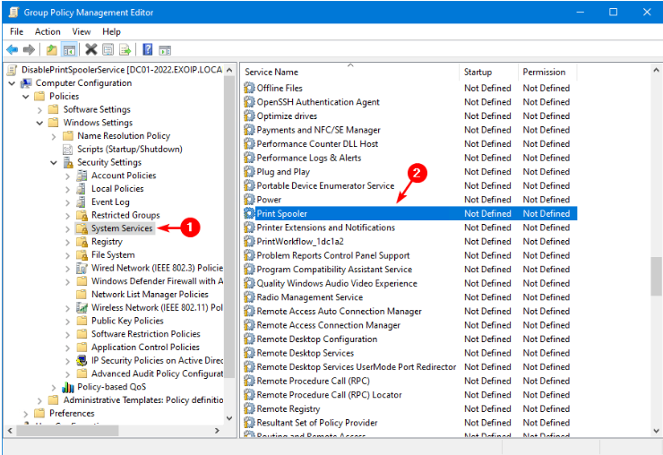
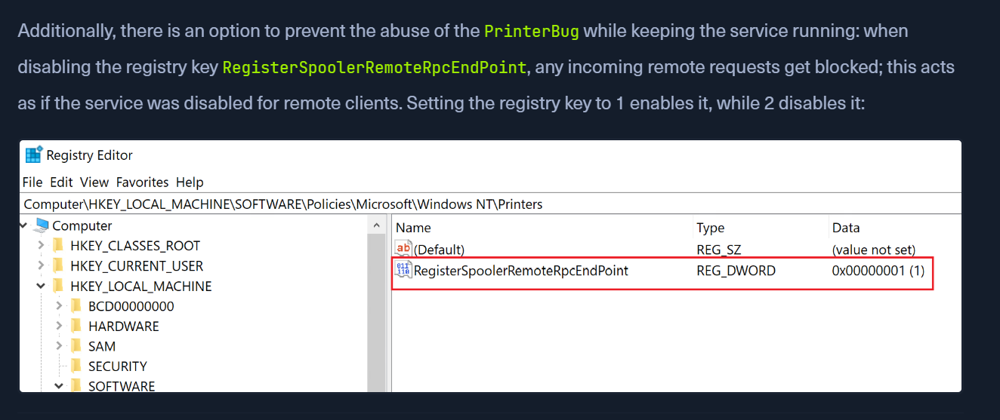

1. Right-click on the **Domain Controllers OU**
2. Select **Create a GPO in this domain, and Link it here…**
3. 5. Name the GPO **DisablePrintSpoolerService** and click **OK**
4. 7. Navigate to **Computer Configuration > Windows Settings > Security Settings > System Services**
5. Double-click on **Print Spooler
6. 9. Select **Define this policy setting**
7. Select **Disabled**
8. Click **OK**

[How to Disable Print Spooler on Domain Controller - ALI TAJRAN](https://www.alitajran.com/disable-print-spooler-domain-controller/)
