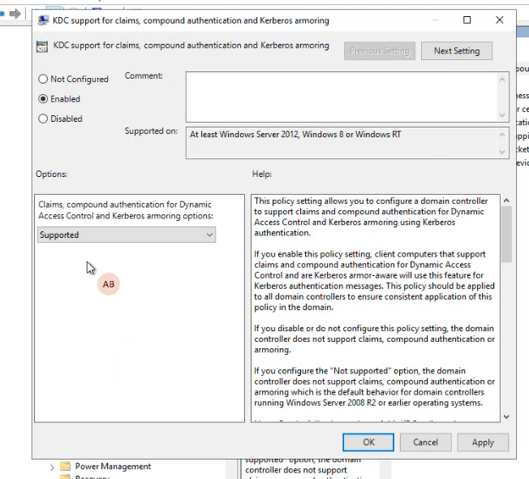
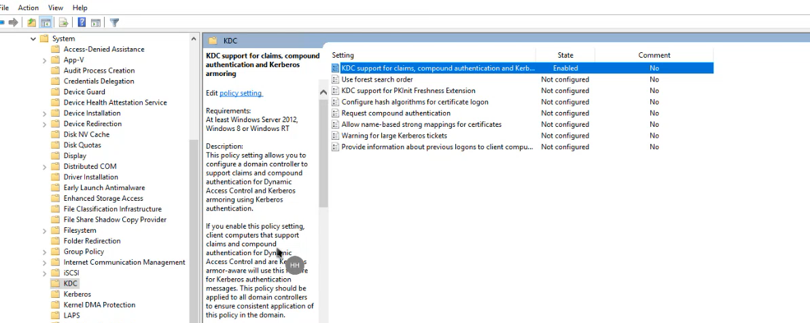
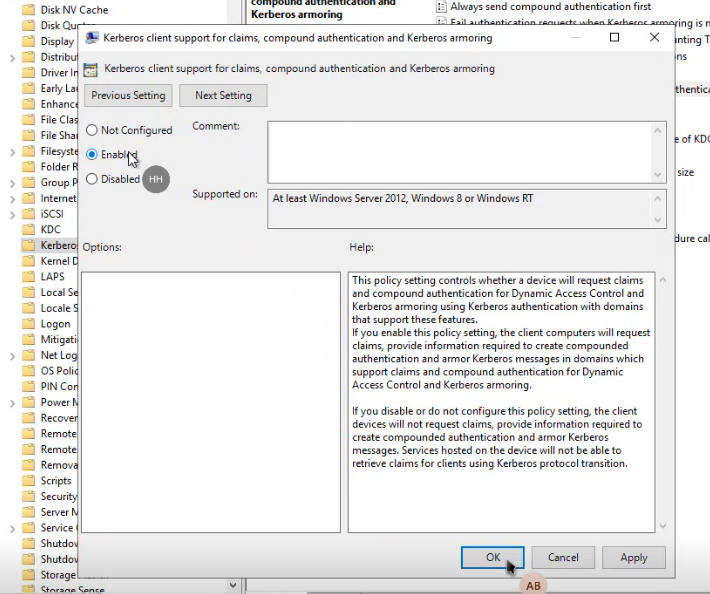
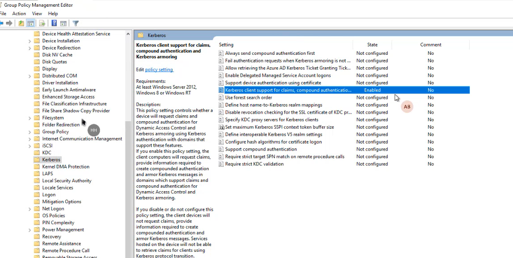
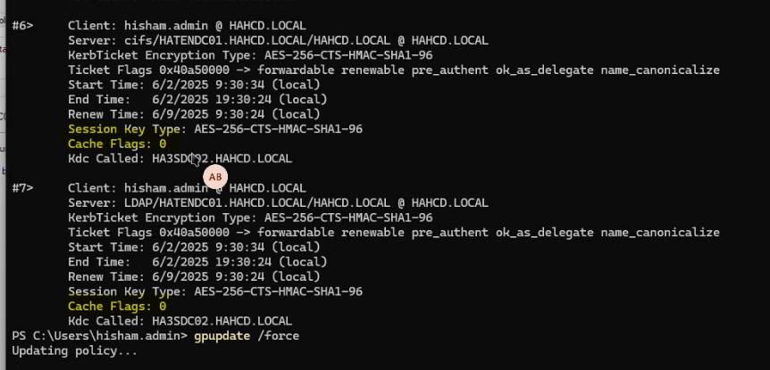
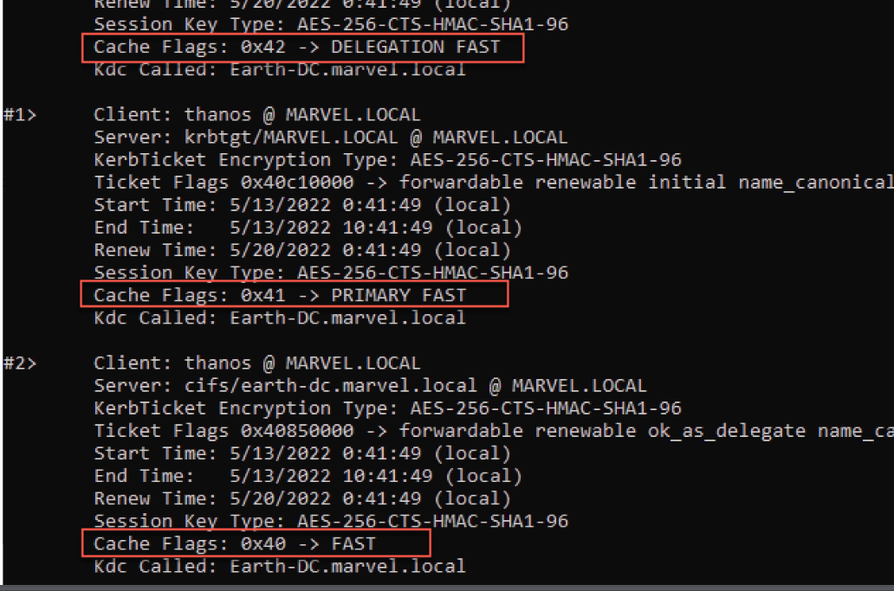

# 🛡️ Kerberos Armoring (FAST)

**Flexible Authentication Secure Tunneling (FAST)**, commonly known as **Kerberos Armoring**, provides a protected channel between the Kerberos client (user workstation) and the Key Distribution Center (KDC/Domain Controller). 

It is designed to protect Kerberos messages from offline dictionary attacks by encrypting the AS-REQ and AS-REP exchanges using the machine's credentials.

## 🚀 Deployment Steps

### 1. Enable Armoring on Domain Controllers (KDC)
Create a new GPO and link it to the **Domain Controllers OU**.

- **Path:** `Computer Configuration` > `Policies` > `Administrative Templates` > `System` > `KDC`
- **Setting:** `KDC support for claims, compound authentication, and Kerberos armoring`
- **Configuration:** Set to **Supported** (Recommended for initial rollout) or **Always provide claims** (More strict).




### 2. Enable Armoring on Clients
Create a new GPO and link it to the **Domain Root** or your workstation OUs.

- **Path:** `Computer Configuration` > `Policies` > `Administrative Templates` > `System` > `Kerberos`
- **Setting:** `Kerberos client support for claims, compound authentication, and Kerberos armoring`
- **Configuration:** Set to **Enabled**.




## 🧪 Verification Commands

After applying the GPOs and running `gpupdate /force`, perform a logoff and login to verify the state.

### Using `klist`
Run the following command in PowerShell or CMD to inspect your Kerberos tickets:

```powershell
klist
```

#### Without Armoring:
Observe that the `Cache Flags` value is typically `0`.


#### With Armoring Enabled:
Look for the `KDC_SUPPORT_FAST` flag or a non-zero `Cache Flags` value (often `0x1`).


### Check Group Policy Results
To confirm the policy is applied correctly to the machine:

```powershell
gpresult /R /SCOPE COMPUTER
```
Ensure the "Kerberos Armoring" GPO is listed under the applied objects.

## 🔗 Resources

- **[TrustedSec: I Wanna Go Fast, Really Fast (Kerberos FAST)](https://www.trustedsec.com/blog/i-wanna-go-fast-really-fast-like-kerberos-fast)** - Excellent deep dive into the protocol.
- **[Microsoft Learn: What's New in Kerberos Authentication](https://learn.microsoft.com/en-us/previous-versions/windows/it-pro/windows-server-2012-r2-and-2012/hh831747(v=ws.11))** - Technical overview.
- **[Trimarc Security: Securing The Chink in Kerberos Armor](https://www.hub.trimarcsecurity.com/post/securing-the-chink-in-kerberos-armor-fast-understanding-the-need-for-kerberos-armoring)** - Why you need it.
- **[Steve Syfuhs: Kerberos FAST Armoring](https://syfuhs.net/kerberos-fast-armoring)** - Comprehensive technical explanation from a Microsoft Identity expert.
- **[Enow Software: It’s Time to Deploy Kerberos Armoring](https://www.enowsoftware.com/solutions-engine/azure-active-directory-center/its-time-to-deploy-kerberos-armoring)** - Practical deployment guide.

---
