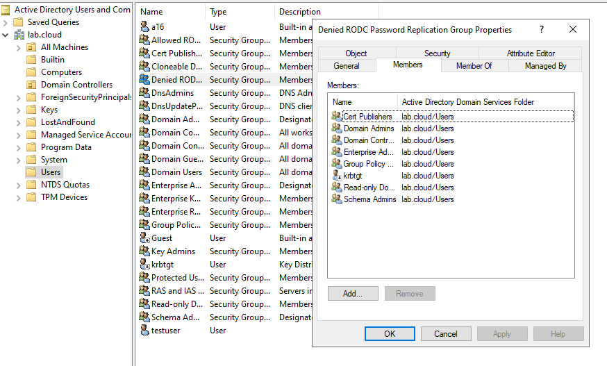
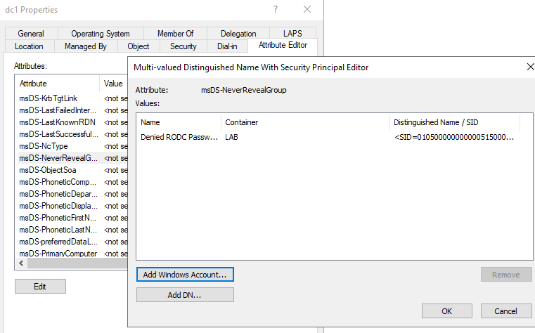

**Advised solution:**
Check the value of the attribute `msDS-NeverRevealGroup` and the presence of the following expected groups:  
- Administrators;  
- Server Operators;  
- Account Operators;  
- Backup Operators;  
- Denied RODC Password Replication Group

| Domain controller | Group                                  |
| ----------------- | -------------------------------------- |
| AzureADKerberos   | Denied RODC Password Replication Group |
**Advised solution:**

Add the items which have been identified as missing to the Denied RODC Password Replication Group group.
  
| Missing        |
| -------------- |
| Krbtgt account |

This group is used to ensure that passwords for certain highly-privileged users or groups are not cached on Read-Only Domain Controllers (RODCs). Removing default members from this group can create a security vulnerability.

The **Denied RODC Password Replication Group** is a domain local group that specifies users and groups whose passwords cannot be cached on RODCs. By default, this group contains the following highly-privileged users and groups:

- The **Enterprise Domain Controllers** group.
- The **Enterprise Read-Only Domain Controllers** group.
- The **Enterprise Admins** group.
- The **Domain Admins** group.
- The **Schema Admins** group.
- The **Group Policy Creator Owners** group.
- The **Cert Publishers** group.
- The domain-wide **krbtgt** account.

[Review the removal of the default members from the Denied RODC Password Replication Group | Microsoft Learn](https://learn.microsoft.com/en-us/services-hub/unified/health/remediation-steps-ad/review-the-removal-of-default-members-from-the-denied-rodc-password-replication-group)
