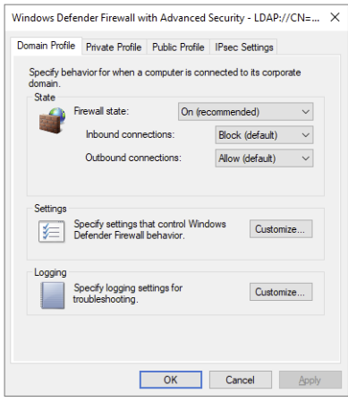
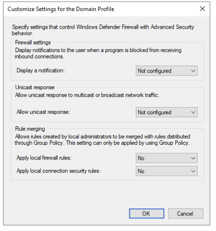
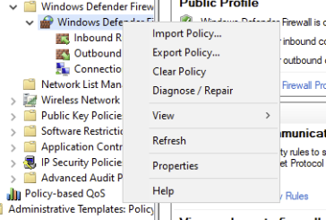
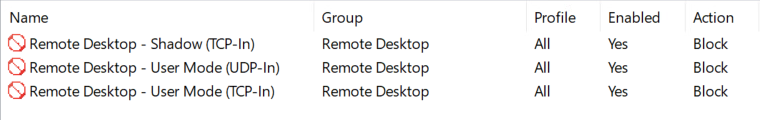
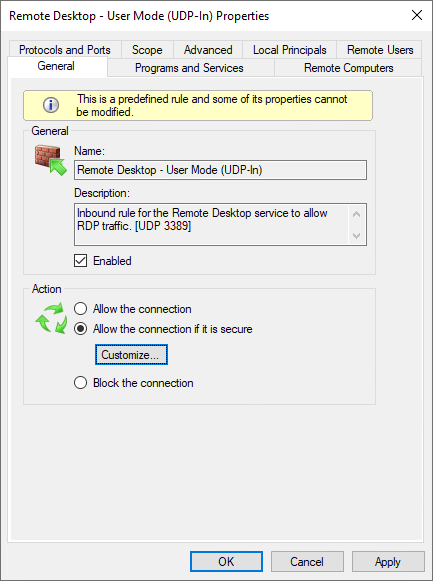
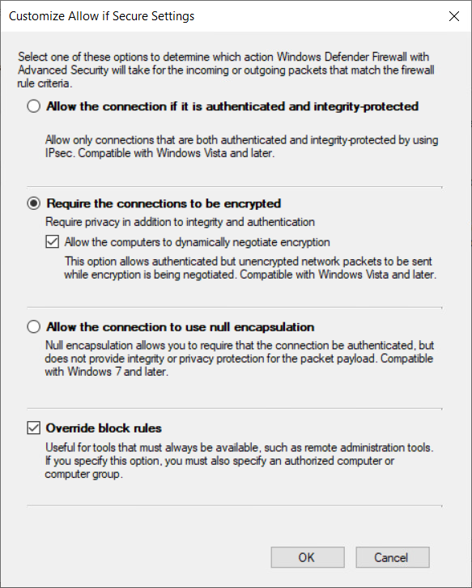
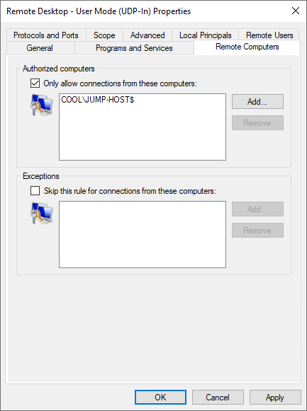

1- From Domain controller that firewall is enable and working , export all rules : 
`netsh advfirewall export "C:\firewall-rules.wfw"`
2- Create Group policy, enable Doamin profile, From Setting Customize: block local rule

3-    import exported rule

4- Create SCR [Securing RDP with IPSec | Microsoft Community Hub](https://techcommunity.microsoft.com/blog/coreinfrastructureandsecurityblog/securing-rdp-with-ipsec/259108) sides DC's & PAW

Setup RDP to DC from jumphostPAW only - with IPSec (TODO: link: Setup RDP to DC from jumphostPAW only - with IPSec)
5 - delete RDP ruls and create new predefine ruls for 
remote desktop and set it as block

6- _Mark Remote Desktop - User Mode (TCP-In)_ and _Remote Desktop - User Mode (UDP-In),_ hit Ctrl+C, and then Ctrl+V to copy and paste the rules. 
7- for both 2 new pasted rules set this settings:

and allow connection form PAW only , you can use group of computers

