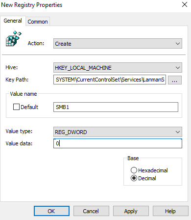
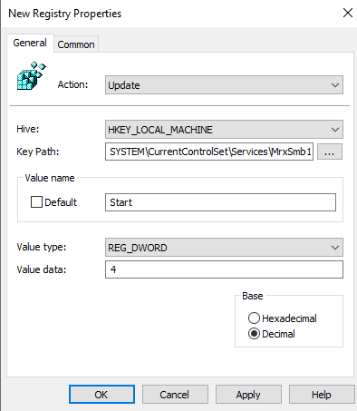
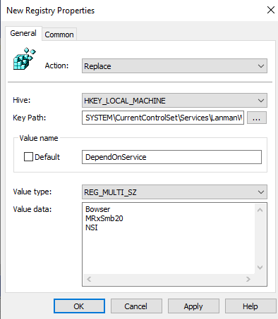
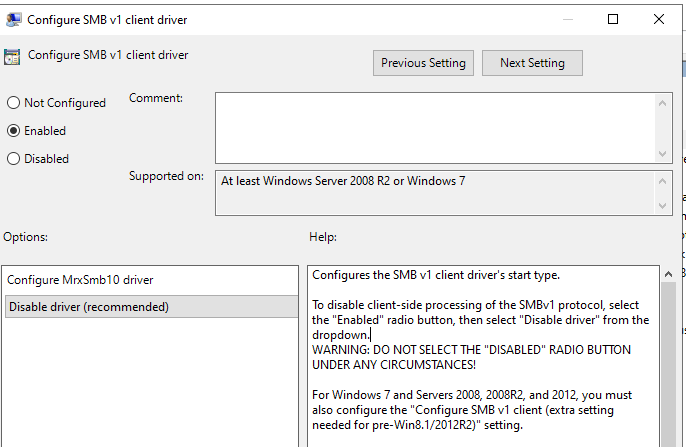

[How to detect, enable and disable SMBv1, SMBv2, and SMBv3 in Windows | Microsoft Learn](https://learn.microsoft.com/en-us/windows-server/storage/file-server/troubleshoot/detect-enable-and-disable-smbv1-v2-v3?tabs=client)


```powershell
#check smb configrations
Get-SmbServerConfiguration | Select EnableSMB1Protocol , EnableSMB2Protocol
OR
Get-WindowsOptionalFeature -Online -FeatureName "SMB1Protocol"

# Disable 
Disable-WindowsOptionalFeature -Online -FeatureName SMB1Protocol

```


```powershell 
# Enable Audit
Set-SmbServerConfiguration -AuditSmb1Access $true -force

# Disable Audit
Set-SmbServerConfiguration -AuditSmb1Access $false -force

# Check Audit 
Get-SmbServerConfiguration | Select AuditSmb1Access
```

> When SMBv1 auditing is enabled, event 3000 appears in the "Microsoft-Windows-SMBServer\Audit" event log, identifying each client that attempts to connect with SMBv1.\


```
Log Name:      Microsoft-Windows-SMBServer/Audit
Source:        Microsoft-Windows-SMBServer
Date:          12/13/2019 11:37:53 AM
Event ID:      3000
Task Category: None
Level:         Information
Keywords:     
User:          N/A
Computer:      DC01.Contoso.com
Description:
SMB1 access

Client Address: 192.168.1.214  <--- Source of SMBv1 Connection

Guidance:
This event indicates that a client attempted to access the server using SMB1. To stop auditing SMB1 access, use the Windows PowerShell cmdlet Set-SmbServerConfiguration.
```
---
#### Disable SMBv1 Server by using Group Policy 
!Pasted image 20230528122910.png (TODO: link: Pasted image 20230528122910.png)

**Disable SMBv1 Server Component**:
```
Action: Create
Hive: HKEY_LOCAL_MACHINE
Key Path: SYSTEM\CurrentControlSet\Services\LanmanServer\Parameters
Value name: SMB1
Value type: REG_DWORD
Value data: 0
```



**Disable SMBv1 Client Component**:

```Powershell 
# Check if SMBv1 is enabled
Get-WindowsOptionalFeature -Online -FeatureName SMB1Protocol

# Disable 
Disable-WindowsOptionalFeature -Online -FeatureName SMB1Protocol

# Enable
Enable-WindowsOptionalFeature -Online -FeatureName SMB1Protocol
```

Using GPO:
```
Action: Update
Hive: HKEY_LOCAL_MACHINE
Key Path: SYSTEM\CurrentControlSet\Services\mrxsmb10
Value Name: Start
Value Type: REG_DWORD
Value Data: 4
```



Then remove the dependency on the **MRxSMB10** that was just disabled. *needed for windows 7*

In the **New Registry Properties** dialog box, select the following:
```
Action: Replace  
Hive: HKEY_LOCAL_MACHINE  
Key Path: SYSTEM\CurrentControlSet\Services\LanmanWorkstation  
Value name: DependOnService  
Value type: REG_MULTI_SZ  
Value data: Bowser,MRxSmb20,NSI
```



[How to detect, enable and disable SMBv1, SMBv2, and SMBv3 in Windows | Microsoft Learn](https://learn.microsoft.com/en-us/windows-server/storage/file-server/troubleshoot/detect-enable-and-disable-smbv1-v2-v3?tabs=server)
[Disable SMBv1 in Managed Environments (Group Policy) – HeelpBook](https://www.heelpbook.net/2017/disable-smbv1-group-policy/#:~:text=To%20disable%20the%20SMBv1%20client%20the%20services%20registry,start%20normally%20without%20requiring%20MRxSMB10%20to%20first%20start.)
[How to Check, Enable or Disable SMB Protocol Versions on Windows? | Windows OS Hub](https://woshub.com/smb-1-0-support-in-windows-server-2012-r2/#h2_5)


Disable smb v1 using baseline:
Configure the policy value for Computer Configuration >> Administrative Templates >> MS Security Guide >> Configure SMBv1 client driver 
[Windows Server 2022 must have the Server Message Block (SMB) v1 protocol disabled on the SMB server.](https://www.stigviewer.com/stig/microsoft_windows_server_2022/2022-08-25/finding/V-254276#:~:text=Configure%20the%20policy%20value%20for%20Computer%20Configuration%20%3E%3E,be%20restarted%20for%20the%20change%20to%20take%20effect.)



https://www.elevenforum.com/t/enable-or-disable-require-smb-client-encryption-in-windows-11.19242/

Get-SmbServerConfiguration | Select EnableSecuritySignature, RequireSecuritySignature

```powershell
# Define log name and event ID
$logName = 'Microsoft-Windows-SMBServer/Audit'
$eventId = 3000
# Collect events
$events = Get-WinEvent -LogName $logName -FilterXPath "*[System[EventID=$eventId]]" -ErrorAction SilentlyContinue
# Extract relevant info and output as CSV
$results = foreach ($event in $events) {
    # Event properties may contain the client address as the first property
    $clientAddress = $null
    if ($event.Properties.Count -gt 0) {
        $clientAddress = $event.Properties[0].Value
    }
    [PSCustomObject]@{
        TimeCreated   = $event.TimeCreated
        EventID       = $event.Id
        ClientAddress = $clientAddress
    }
}
# Export to CSV file
$results | Export-Csv -Path "C:\SMB1_ClientAddresses.csv" -NoTypeInformation
# Remove duplicates based on ClientAddress
$uniqueResults = $results | Sort-Object ClientAddress -Unique
# Export to a new CSV or overwrite the original
$uniqueResults | Export-Csv -Path "C:\SMB1_ClientAddresses_Unique.csv" -NoTypeInformation
Write-Output "Duplicates removed. Results saved to C:\SMB1_ClientAddresses_Unique.csv"
Write-Output "Export complete. Results saved to C:\SMB1_ClientAddresses.csv"
```


```
Get-SmbConnection
```

```powershell
#Export all open session 
Get-SmbSession |
    Select-Object ClientComputerName, ClientUserName, Dialect |
    Export-Csv -Path "C:\SMB_Sessions.csv" -NoTypeInformation
```
