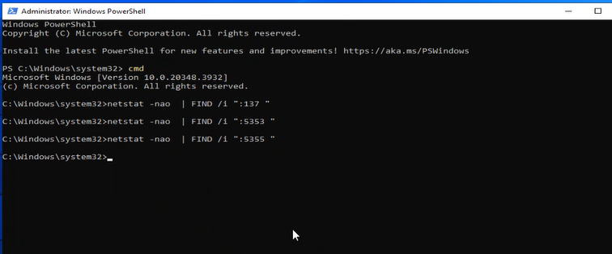
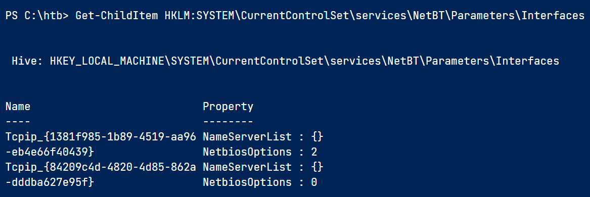

Create New GPO and create schedule task with this script:

```powershell
#disable netbios
$regkey = "HKLM:SYSTEM\CurrentControlSet\services\NetBT\Parameters\Interfaces"  
Get-ChildItem $regkey |foreach { Set-ItemProperty -Path "$regkey\$($_.pschildname)" -Name NetbiosOptions -Value 2 -Verbose}
#disable mDNS
Set-ItemProperty -Path "HKLM:\SYSTEM\CurrentControlSet\Services\Dnscache\Parameters" -Name "EnableMDNS" -Type DWord -Value 0 -Force
```

Disable LLMNR:
Computer Configuration > Administrative Templates > Network > DNS Client
Configure the Policy:
    - Find **Turn off multicast name resolution**
    - Set it to **Enabled**

Link to all machines and server and DCs


for mDNS it's recommended to close the port by firewall -> 5353 UDP


Test ports:
```powershell
#netbios port
netstat -nao  | FIND /i ":137 "  
#mDNS port 
netstat -nao  | FIND /i ":5353 "  
#llmnr port
netstat -nao  | FIND /i ":5355 "


#check netbios reg value
wmic nicconfig get caption,index,TcpipNetbiosOptions
#or
Get-ChildItem HKLM:SYSTEM\CurrentControlSet\services\NetBT\Parameters\Interfaces
```




