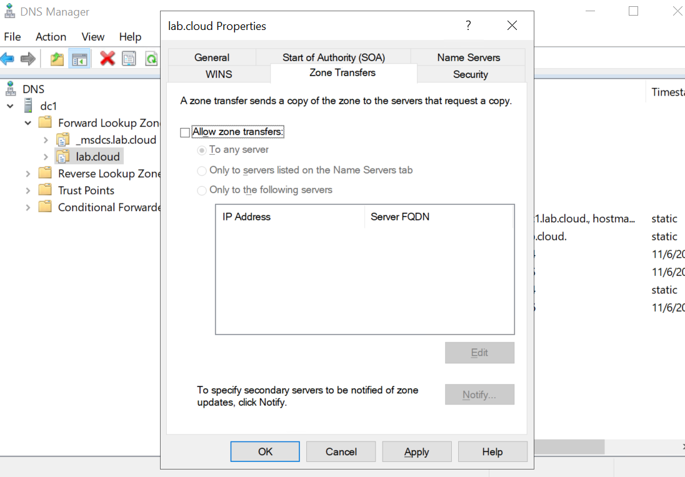

| Zone            |
| --------------- |
| bojdomain.local |

**Steps:**
Go to the DNS console and select a zone in the "Forward Lookup Zones".  
Right click on it and switch to the "Zone Transfers" tab.  
Then ensure "Allow zone transfers" is not enabled "To any server".  
You can also run: dnscmd /zoneresetsecondaries zone /noxfr

