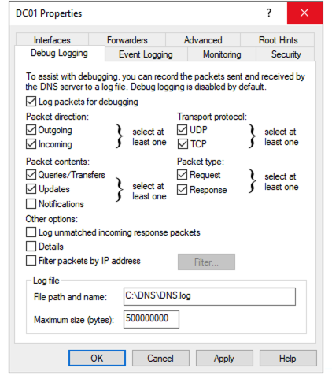

Add-DnsServerQueryResolutionPolicy -Name "BlackholePolicy" -Action IGNORE -FQDN "EQ,*.treyresearch.com"

https://learn.microsoft.com/en-us/windows-server/networking/dns/deploy/dns-policies-overview#block-queries-for-a-domain

Logging:

The queries source most probably will be from endpoints querying the DCs

· Enable DNS debugging

·

· Query SIEM, XDR or EDR for DNS events

##  Microsoft-Windows-DNSServer/Analytical
Enable it then you have to disable before open it 
Enable DNS Analytical Logging (Event Viewer)
	•	Open Event Viewer (`eventvwr.msc`).
	•	Navigate to Applications and Services Logs > Microsoft > Windows > DNS-Server.
	•	Right-click DNS-Server, go to View, and select Show Analytic and Debug Logs.
	•	Right-click the Analytical log and select Enable Log.
	•	The log is saved as an ETL file:
`%SystemRoot%\System32\Winevt\Logs\Microsoft-Windows-DNSServer%4Analytical.etl`
	•	This logs every time the server sends or receives DNS information, including queries.


```
Log Name:      Microsoft-Windows-DNSServer/Analytical
Source:        Microsoft-Windows-DNSServer
Date:          8/13/2025 4:04:51 PM
Event ID:      259
Task Category: LOOK_UP
Level:         Error
Keywords:      (8)
User:          N/A
Computer:      DC01.contoso.com
Description:
IGNORED_QUERY: TCP=0; InterfaceIP=192.168.51.11; Source=192.168.1.101; Reason=Policy; QNAME=www.abayoumy.tech.; QTYPE=1; XID=57657; Zone=NULL; PolicyName=BlackholePolicy; AdditionalInfo = VirtualizationInstance: .
Event Xml:
<Event xmlns="http://schemas.microsoft.com/win/2004/08/events/event">
  <System>
    <Provider Name="Microsoft-Windows-DNSServer" Guid="{eb79061a-a566-4698-9119-3ed2807060e7}" />
    <EventID>259</EventID>
    <Version>0</Version>
    <Level>2</Level>
    <Task>1</Task>
    <Opcode>0</Opcode>
    <Keywords>0x8000000000000008</Keywords>
    <TimeCreated SystemTime="2025-08-13T13:04:51.3550852Z" />
    <EventRecordID>160</EventRecordID>
    <Correlation />
    <Execution ProcessID="3336" ThreadID="5748" />
    <Channel>Microsoft-Windows-DNSServer/Analytical</Channel>
    <Computer>DC01.contoso.com</Computer>
    <Security />
  </System>
  <EventData>
    <Data Name="TCP">0</Data>
    <Data Name="InterfaceIP">192.168.51.11</Data>
    <Data Name="Source">192.168.1.101</Data>
    <Data Name="Reason">Policy</Data>
    <Data Name="QNAME">www.abayoumy.tech.</Data>
    <Data Name="QTYPE">1</Data>
    <Data Name="XID">57657</Data>
    <Data Name="Zone">NULL</Data>
    <Data Name="PolicyName">BlackholePolicy</Data>
    <Data Name="AdditionalInfo">.</Data>
  </EventData>
</Event>
```


```
$logName = "Microsoft-Windows-DNSServer/Analytical"
 Get-WinEvent -LogName $logName -Oldest | Where-Object { $_.Message -like "*abayoumy*" } | Format-Table TimeCreated, Id, Message -AutoSize
```

```
8/13/2025 4:02:03 PM 256 QUERY_RECEIVED: TCP=0; InterfaceIP=192.168.51.11; Source=192.168.1.101; RD=1; QNAME=www.abayoumy.tech.; QTYPE=1; XID=30291; Port=57943; Flags=256; PacketData=0x7653010000010000000000000377777708616261796F756D7904746563680000010001; AdditionalInfo = VirtualizationInstanceOptionValue: .; G...
8/13/2025 4:02:03 PM 260 RECURSE_QUERY_OUT: TCP=0; Destination=8.8.8.8; InterfaceIP=0.0.0.0; RD=1; QNAME=www.abayoumy.tech.; QTYPE=1; QXID=30291; XID=45350; Port=0; Flags=256; RecursionScope=.; CacheScope=Default; PolicyName=NULL; PacketData=0xB126010000010000000000010377777708616261796F756D790474656368000001000...
8/13/2025 4:02:03 PM 256 QUERY_RECEIVED: TCP=0; InterfaceIP=192.168.51.11; Source=192.168.1.101; RD=1; QNAME=www.abayoumy.tech.; QTYPE=28; XID=40991; Port=50073; Flags=256; PacketData=0xA01F010000010000000000000377777708616261796F756D79047465636800001C0001; AdditionalInfo = VirtualizationInstanceOptionValue: .; ...
8/13/2025 4:02:03 PM 260 RECURSE_QUERY_OUT: TCP=0; Destination=8.8.8.8; InterfaceIP=0.0.0.0; RD=1; QNAME=www.abayoumy.tech.; QTYPE=28; QXID=40991; XID=50846; Port=0; Flags=256; RecursionScope=.; CacheScope=Default; PolicyName=NULL; PacketData=0xC69E010000010000000000010377777708616261796F756D79047465636800001C00...
8/13/2025 4:02:03 PM 256 QUERY_RECEIVED: TCP=0; InterfaceIP=192.168.51.11; Source=192.168.1.101; RD=1; QNAME=www.abayoumy.tech.; QTYPE=1; XID=30291; Port=57943; Flags=256; PacketData=0x7653010000010000000000000377777708616261796F756D7904746563680000010001; AdditionalInfo = VirtualizationInstanceOptionValue: .; G...
8/13/2025 4:02:03 PM 256 QUERY_RECEIVED: TCP=0; InterfaceIP=192.168.51.11; Source=192.168.1.101; RD=1; QNAME=www.abayoumy.tech.; QTYPE=28; XID=40991; Port=50073; Flags=256; PacketData=0xA01F010000010000000000000377777708616261796F756D79047465636800001C0001; AdditionalInfo = VirtualizationInstanceOptionValue: .; ...
8/13/2025 4:02:03 PM 261 RECURSE_RESPONSE_IN: TCP=0; Source=8.8.8.8; InterfaceIP=0.0.0.0; AA=0; AD=0; QNAME=www.abayoumy.tech.; QTYPE=1; XID=45350; RemoteQueriesSent=1; Port=0; Flags=33152; RecursionScope=.; CacheScope=Default; PacketData=0xB126818000010005000000010377777708616261796F756D7904746563680000010001C0...
8/13/2025 4:02:03 PM 257 RESPONSE_SUCCESS: TCP=0; InterfaceIP=192.168.51.11; Destination=192.168.1.101; AA=0; AD=0; QNAME=www.abayoumy.tech.; QTYPE=1; XID=30291; DNSSEC=0; RCODE=0; Port=57943; Flags=33152; Scope=Default; Zone=..Cache; PolicyName=NULL; PacketData=0x7653818000010004000000000377777708616261796F756D...
8/13/2025 4:02:03 PM 261 RECURSE_RESPONSE_IN: TCP=0; Source=8.8.8.8; InterfaceIP=0.0.0.0; AA=0; AD=0; QNAME=www.abayoumy.tech.; QTYPE=28; XID=50846; RemoteQueriesSent=1; Port=0; Flags=33152; RecursionScope=.; CacheScope=Default; PacketData=0xC69E818000010000000400010377777708616261796F756D79047465636800001C0001C...
8/13/2025 4:02:03 PM 257 RESPONSE_SUCCESS: TCP=0; InterfaceIP=192.168.51.11; Destination=192.168.1.101; AA=0; AD=0; QNAME=www.abayoumy.tech.; QTYPE=28; XID=40991; DNSSEC=0; RCODE=0; Port=50073; Flags=33152; Scope=Default; Zone=..Cache; PolicyName=NULL; PacketData=0xA01F818000010000000100000377777708616261796F756...
8/13/2025 4:04:51 PM 256 QUERY_RECEIVED: TCP=0; InterfaceIP=192.168.51.11; Source=192.168.1.101; RD=1; QNAME=www.abayoumy.tech.; QTYPE=1; XID=57657; Port=53511; Flags=256; PacketData=0xE139010000010000000000000377777708616261796F756D7904746563680000010001; AdditionalInfo = VirtualizationInstanceOptionValue: .; G...
8/13/2025 4:04:51 PM 259 IGNORED_QUERY: TCP=0; InterfaceIP=192.168.51.11; Source=192.168.1.101; Reason=Policy; QNAME=www.abayoumy.tech.; QTYPE=1; XID=57657; Zone=NULL; PolicyName=BlackholePolicy; AdditionalInfo = VirtualizationInstance: .
8/13/2025 4:04:51 PM 256 QUERY_RECEIVED: TCP=0; InterfaceIP=192.168.51.11; Source=192.168.1.101; RD=1; QNAME=www.abayoumy.tech.; QTYPE=28; XID=47278; Port=64755; Flags=256; PacketData=0xB8AE010000010000000000000377777708616261796F756D79047465636800001C0001; AdditionalInfo = VirtualizationInstanceOptionValue: .; ...
8/13/2025 4:04:51 PM 259 IGNORED_QUERY: TCP=0; InterfaceIP=192.168.51.11; Source=192.168.1.101; Reason=Policy; QNAME=www.abayoumy.tech.; QTYPE=28; XID=47278; Zone=NULL; PolicyName=BlackholePolicy; AdditionalInfo = VirtualizationInstance: .
8/13/2025 4:04:51 PM 256 QUERY_RECEIVED: TCP=0; InterfaceIP=192.168.51.11; Source=192.168.1.101; RD=1; QNAME=www.abayoumy.tech.; QTYPE=1; XID=57657; Port=53511; Flags=256; PacketData=0xE139010000010000000000000377777708616261796F756D7904746563680000010001; AdditionalInfo = VirtualizationInstanceOptionValue: .; G...
8/13/2025 4:04:51 PM 256 QUERY_RECEIVED: TCP=0; InterfaceIP=192.168.51.11; Source=192.168.1.101; RD=1; QNAME=www.abayoumy.tech.; QTYPE=28; XID=47278; Port=64755; Flags=256; PacketData=0xB8AE010000010000000000000377777708616261796F756D79047465636800001C0001; AdditionalInfo = VirtualizationInstanceOptionValue: .; ...
8/13/2025 4:04:51 PM 259 IGNORED_QUERY: TCP=0; InterfaceIP=192.168.51.11; Source=192.168.1.101; Reason=Policy; QNAME=www.abayoumy.tech.; QTYPE=28; XID=47278; Zone=NULL; PolicyName=BlackholePolicy; AdditionalInfo = VirtualizationInstance: .
8/13/2025 4:04:51 PM 259 IGNORED_QUERY: TCP=0; InterfaceIP=192.168.51.11; Source=192.168.1.101; Reason=Policy; QNAME=www.abayoumy.tech.; QTYPE=1; XID=57657; Zone=NULL; PolicyName=BlackholePolicy; AdditionalInfo = VirtualizationInstance: .
8/13/2025 4:04:52 PM 256 QUERY_RECEIVED: TCP=0; InterfaceIP=192.168.51.11; Source=192.168.1.101; RD=1; QNAME=www.abayoumy.tech.; QTYPE=28; XID=47278; Port=64755; Flags=256; PacketData=0xB8AE010000010000000000000377777708616261796F756D79047465636800001C0001; AdditionalInfo = VirtualizationInstanceOptionValue: .; ...
8/13/2025 4:04:52 PM 256 QUERY_RECEIVED: TCP=0; InterfaceIP=192.168.51.11; Source=192.168.1.101; RD=1; QNAME=www.abayoumy.tech.; QTYPE=1; XID=57657; Port=53511; Flags=256; PacketData=0xE139010000010000000000000377777708616261796F756D7904746563680000010001; AdditionalInfo = VirtualizationInstanceOptionValue: .; G...
8/13/2025 4:04:52 PM 259 IGNORED_QUERY: TCP=0; InterfaceIP=192.168.51.11; Source=192.168.1.101; Reason=Policy; QNAME=www.abayoumy.tech.; QTYPE=28; XID=47278; Zone=NULL; PolicyName=BlackholePolicy; AdditionalInfo = VirtualizationInstance: .
8/13/2025 4:04:52 PM 259 IGNORED_QUERY: TCP=0; InterfaceIP=192.168.51.11; Source=192.168.1.101; Reason=Policy; QNAME=www.abayoumy.tech.; QTYPE=1; XID=57657; Zone=NULL; PolicyName=BlackholePolicy; AdditionalInfo = VirtualizationInstance: .
8/13/2025 4:04:54 PM 256 QUERY_RECEIVED: TCP=0; InterfaceIP=192.168.51.11; Source=192.168.1.101; RD=1; QNAME=www.abayoumy.tech.; QTYPE=28; XID=47278; Port=64755; Flags=256; PacketData=0xB8AE010000010000000000000377777708616261796F756D79047465636800001C0001; AdditionalInfo = VirtualizationInstanceOptionValue: .; ...
8/13/2025 4:04:54 PM 256 QUERY_RECEIVED: TCP=0; InterfaceIP=192.168.51.11; Source=192.168.1.101; RD=1; QNAME=www.abayoumy.tech.; QTYPE=1; XID=57657; Port=53511; Flags=256; PacketData=0xE139010000010000000000000377777708616261796F756D7904746563680000010001; AdditionalInfo = VirtualizationInstanceOptionValue: .; G...
8/13/2025 4:04:54 PM 259 IGNORED_QUERY: TCP=0; InterfaceIP=192.168.51.11; Source=192.168.1.101; Reason=Policy; QNAME=www.abayoumy.tech.; QTYPE=1; XID=57657; Zone=NULL; PolicyName=BlackholePolicy; AdditionalInfo = VirtualizationInstance: .
8/13/2025 4:04:54 PM 259 IGNORED_QUERY: TCP=0; InterfaceIP=192.168.51.11; Source=192.168.1.101; Reason=Policy; QNAME=www.abayoumy.tech.; QTYPE=28; XID=47278; Zone=NULL; PolicyName=BlackholePolicy; AdditionalInfo = VirtualizationInstance: .
8/13/2025 4:04:58 PM 256 QUERY_RECEIVED: TCP=0; InterfaceIP=192.168.51.11; Source=192.168.1.101; RD=1; QNAME=www.abayoumy.tech.; QTYPE=1; XID=57657; Port=53511; Flags=256; PacketData=0xE139010000010000000000000377777708616261796F756D7904746563680000010001; AdditionalInfo = VirtualizationInstanceOptionValue: .; G...
8/13/2025 4:04:58 PM 256 QUERY_RECEIVED: TCP=0; InterfaceIP=192.168.51.11; Source=192.168.1.101; RD=1; QNAME=www.abayoumy.tech.; QTYPE=28; XID=47278; Port=64755; Flags=256; PacketData=0xB8AE010000010000000000000377777708616261796F756D79047465636800001C0001; AdditionalInfo = VirtualizationInstanceOptionValue: .; ...
8/13/2025 4:04:58 PM 259 IGNORED_QUERY: TCP=0; InterfaceIP=192.168.51.11; Source=192.168.1.101; Reason=Policy; QNAME=www.abayoumy.tech.; QTYPE=28; XID=47278; Zone=NULL; PolicyName=BlackholePolicy; AdditionalInfo = VirtualizationInstance: .
8/13/2025 4:04:58 PM 259 IGNORED_QUERY: TCP=0; InterfaceIP=192.168.51.11; Source=192.168.1.101; Reason=Policy; QNAME=www.abayoumy.tech.; QTYPE=1; XID=57657; Zone=NULL; PolicyName=BlackholePolicy; AdditionalInfo = VirtualizationInstance: .
8/13/2025 4:05:02 PM 256 QUERY_RECEIVED: TCP=0; InterfaceIP=192.168.51.11; Source=192.168.1.101; RD=1; QNAME=www.abayoumy.tech.; QTYPE=28; XID=36403; Port=60556; Flags=256; PacketData=0x8E33010000010000000000000377777708616261796F756D79047465636800001C0001; AdditionalInfo = VirtualizationInstanceOptionValue: .; ...
8/13/2025 4:05:02 PM 259 IGNORED_QUERY: TCP=0; InterfaceIP=192.168.51.11; Source=192.168.1.101; Reason=Policy; QNAME=www.abayoumy.tech.; QTYPE=28; XID=36403; Zone=NULL; PolicyName=BlackholePolicy; AdditionalInfo = VirtualizationInstance: .
8/13/2025 4:05:02 PM 256 QUERY_RECEIVED: TCP=0; InterfaceIP=192.168.51.11; Source=192.168.1.101; RD=1; QNAME=www.abayoumy.tech.; QTYPE=28; XID=36403; Port=60556; Flags=256; PacketData=0x8E33010000010000000000000377777708616261796F756D79047465636800001C0001; AdditionalInfo = VirtualizationInstanceOptionValue: .; ...
8/13/2025 4:05:02 PM 259 IGNORED_QUERY: TCP=0; InterfaceIP=192.168.51.11; Source=192.168.1.101; Reason=Policy; QNAME=www.abayoumy.tech.; QTYPE=28; XID=36403; Zone=NULL; PolicyName=BlackholePolicy; AdditionalInfo = VirtualizationInstance: .
8/13/2025 4:05:03 PM 256 QUERY_RECEIVED: TCP=0; InterfaceIP=192.168.51.11; Source=192.168.1.101; RD=1; QNAME=www.abayoumy.tech.; QTYPE=28; XID=36403; Port=60556; Flags=256; PacketData=0x8E33010000010000000000000377777708616261796F756D79047465636800001C0001; AdditionalInfo = VirtualizationInstanceOptionValue: .; ...
8/13/2025 4:05:03 PM 259 IGNORED_QUERY: TCP=0; InterfaceIP=192.168.51.11; Source=192.168.1.101; Reason=Policy; QNAME=www.abayoumy.tech.; QTYPE=28; XID=36403; Zone=NULL; PolicyName=BlackholePolicy; AdditionalInfo = VirtualizationInstance: .
8/13/2025 4:05:05 PM 256 QUERY_RECEIVED: TCP=0; InterfaceIP=192.168.51.11; Source=192.168.1.101; RD=1; QNAME=www.abayoumy.tech.; QTYPE=28; XID=36403; Port=60556; Flags=256; PacketData=0x8E33010000010000000000000377777708616261796F756D79047465636800001C0001; AdditionalInfo = VirtualizationInstanceOptionValue: .; ...
8/13/2025 4:05:05 PM 259 IGNORED_QUERY: TCP=0; InterfaceIP=192.168.51.11; Source=192.168.1.101; Reason=Policy; QNAME=www.abayoumy.tech.; QTYPE=28; XID=36403; Zone=NULL; PolicyName=BlackholePolicy; AdditionalInfo = VirtualizationInstance: .
8/13/2025 4:05:09 PM 256 QUERY_RECEIVED: TCP=0; InterfaceIP=192.168.51.11; Source=192.168.1.101; RD=1; QNAME=www.abayoumy.tech.; QTYPE=28; XID=36403; Port=60556; Flags=256; PacketData=0x8E33010000010000000000000377777708616261796F756D79047465636800001C0001; AdditionalInfo = VirtualizationInstanceOptionValue: .; ...
8/13/2025 4:05:09 PM 259 IGNORED_QUERY: TCP=0; InterfaceIP=192.168.51.11; Source=192.168.1.101; Reason=Policy; QNAME=www.abayoumy.tech.; QTYPE=28; XID=36403; Zone=NULL; PolicyName=BlackholePolicy; AdditionalInfo = VirtualizationInstance: .
```
-------
# LAB 

```Powershell
Add-DnsServerQueryResolutionPolicy -Name "BlockYoutubeFacebook" -Action IGNORE -FQDN "EQ,*.youtube.com;EQ,*.facebook.com" -Condition OR
```

```
Add-DnsServerQueryResolutionPolicy -Name "BlackholePolicy" -Action IGNORE -FQDN "EQ,*.abayoumy.tech"
```



```Powershell
$policies = Get-DnsServerQueryResolutionPolicy
foreach ($policy in $policies) {
    Write-Output "Policy Name: $($policy.Name)"
    $policy.Criteria | Format-List *
}
```


```
$policies = Get-DnsServerQueryResolutionPolicy
foreach ($policy in $policies) {

Policy Name: BlackholePolicy


Criteria              : EQ,*.abayoumy.tech.
CriteriaType          : Fqdn
PSComputerName        :
CimClass              : root/Microsoft/Windows/DNS:DnsServerPolicyCriteria
CimInstanceProperties : {Criteria, CriteriaType}
CimSystemProperties   : Microsoft.Management.Infrastructure.CimSystemProperties
```

### log
--- Before Policy
8/13/2025 4:02:03 PM 1674 PACKET  0000018CEDDB1140 UDP Rcv 192.168.1.101   7653   Q [0001   D   NOERROR] A      (3)www(8)abayoumy(4)tech(0)
8/13/2025 4:02:03 PM 1674 PACKET  0000018CF023BDD0 UDP Snd 8.8.8.8         b126   Q [0001   D   NOERROR] A      (3)www(8)abayoumy(4)tech(0)
8/13/2025 4:02:03 PM 1674 PACKET  0000018CEDCFE5A0 UDP ==Rcv 192.168.1.101==   a01f   Q [0001   D   NOERROR] AAAA   (3)www(8)abayoumy(4)tech(0)
8/13/2025 4:02:03 PM 1674 PACKET  0000018CF32F8950 UDP ==Snd 8.8.8.8==         c69e   Q [0001   D   NOERROR] AAAA   (3)www(8)abayoumy(4)tech(0)
8/13/2025 4:02:03 PM 1674 PACKET  0000018CF1C92D00 UDP Rcv 192.168.1.101   7653   Q [0001   D   NOERROR] A      (3)www(8)abayoumy(4)tech(0)
8/13/2025 4:02:03 PM 1670 PACKET  0000018CEF9070B0 UDP Rcv 192.168.1.101   a01f   Q [0001   D   NOERROR] AAAA   (3)www(8)abayoumy(4)tech(0)
8/13/2025 4:02:03 PM 1670 PACKET  0000018CF11B6950 UDP ==Rcv 8.8.8.8==         b126 R Q [8081   DR  NOERROR] A      (3)www(8)abayoumy(4)tech(0)
8/13/2025 4:02:03 PM 1670 PACKET  0000018CEDDB1140 UDP ==Snd 192.168.1.101==   7653 R Q [8081   DR  NOERROR] A      (3)www(8)abayoumy(4)tech(0)
8/13/2025 4:02:03 PM 1670 PACKET  0000018CF10C1DC0 UDP Rcv 8.8.8.8         c69e R Q [8081   DR  NOERROR] AAAA   (3)www(8)abayoumy(4)tech(0)
8/13/2025 4:02:03 PM 1670 PACKET  0000018CEDCFE5A0 UDP Snd 192.168.1.101   a01f R Q [8081   DR  NOERROR] AAAA   (3)www(8)abayoumy(4)tech(0)
------ After Policy
8/13/2025 4:05:02 PM 1670 PACKET  0000018CF06DFD40 UDP Rcv 192.168.1.101   8e33   Q [0001   D   NOERROR] AAAA   (3)www(8)abayoumy(4)tech(0)
8/13/2025 4:05:02 PM 1670 PACKET  0000018CEDCFE5A0 UDP Rcv 192.168.1.101   8e33   Q [0001   D   NOERROR] AAAA   (3)www(8)abayoumy(4)tech(0)
8/13/2025 4:05:03 PM 1670 PACKET  0000018CF3C11DD0 UDP Rcv 192.168.1.101   8e33   Q [0001   D   NOERROR] AAAA   (3)www(8)abayoumy(4)tech(0)
8/13/2025 4:05:05 PM 1670 PACKET  0000018CEE6610B0 UDP Rcv 192.168.1.101   8e33   Q [0001   D   NOERROR] AAAA   (3)www(8)abayoumy(4)tech(0)
8/13/2025 4:05:09 PM 1670 PACKET  0000018CF26250B0 UDP Rcv 192.168.1.101   8e33   Q [0001   D   NOERROR] AAAA   (3)www(8)abayoumy(4)tech(0)

```powershell
Remove-DnsServerQueryResolutionPolicy -Name "BlackholePolicy"
```
