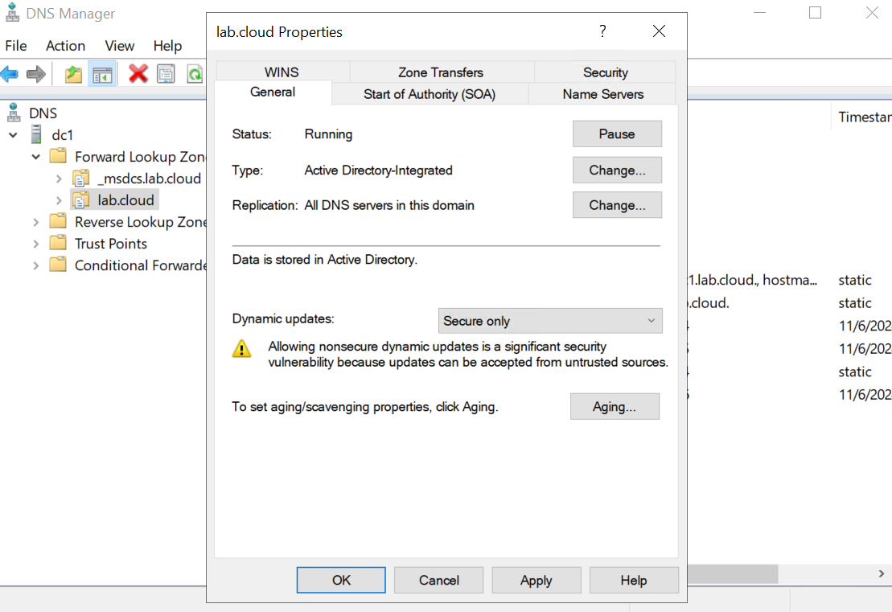

| Zone                   |
| ---------------------- |
| boj.local              |
| pais.demo              |
| NETWORK.GLOBAL         |
| 17.24.172.in-addr.arpa |
| 12.195.10.in-addr.arpa |
| 12.230.10.in-addr.arpa |

**Note:**  Secure updates require client machines to authenticate using Kerberos, This ensures that only domain-joined computers can update DNS records.
Devices that are not part of the domain (i.e., not joined to the AD domain) may not be able to update their DNS records automatically, as they cannot authenticate using Kerberos. This could affect devices like printers, IoT devices, or legacy systems that are not domain-joined.

**Steps**
Go to the DNS console and select a zone in the "Forward Lookup Zones".  
Right click on it and switch to the "General" tab.  
Then change Dynamic updates from "Nonsecure and secure" to "Secure only".

