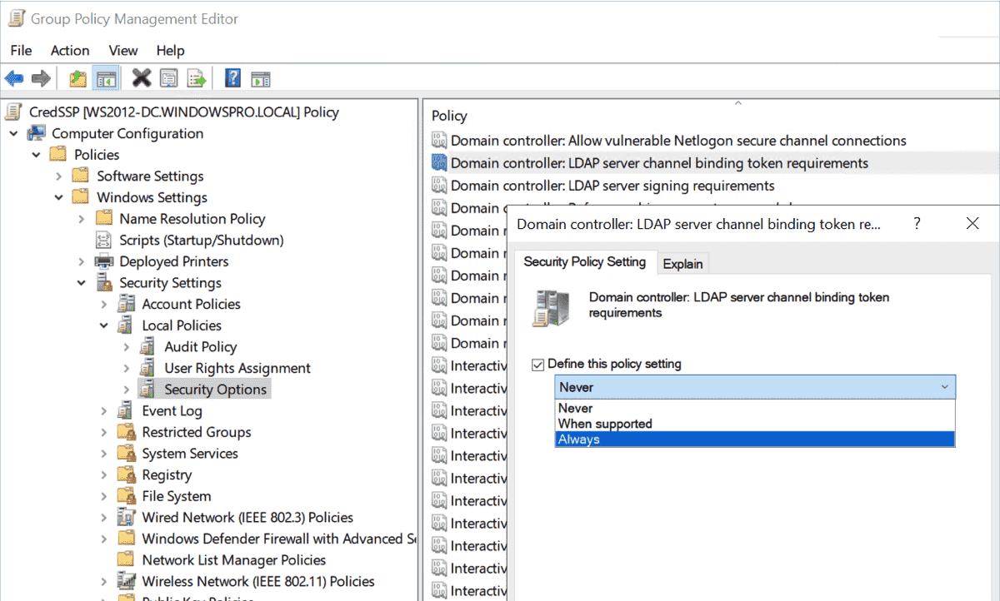
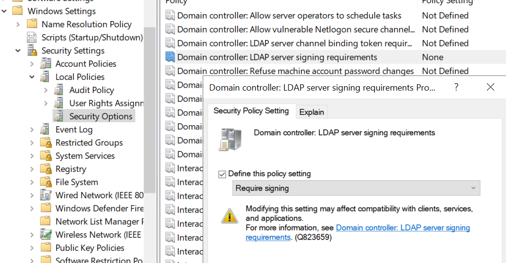

Steps to configure LDAPS:
1. Enable Audit.
2. Change Log size.
3. Collect LDAP events.
4. Enable channel binding.
5. Enable LDAP signing.
6. Disable Audit.


##### Enable LDAP Audit
1. Using PowerShell
`New-ItemProperty -Path "HKLM:\SYSTEM\CurrentControlSet\Services\NTDS\Diagnostics" -Name "16 LDAP Interface Events" -Value 2 -PropertyType DWORD -Force` 

2. Using GPO:
	1. Create new GPO named Audit LDAP
	2. Edit and Go to `Computer Configuration > Preferences > Windows Settings > Registry`
	3. Create new Registry `New > Registry Item > Key Path > HKEY_LOCAL_MACHINE\SYSTEM\CurrentControlSet\Services\NTDS\Diagnostics >16 LDAP Interface Events`
	4. Change Base to Decimal and  set Value data to 2


##### Change Log size
1. Navigate to  `Event viewer > Applications and Services logs > Directory Service` 
2. Right-click `Properties > Maximum log size > 102400 (100M)` 
3. repeat on all DCs.


##### Collect LDAP events
To see LDAP logs open `Event viewer > Applications and Services logs > Directory Service` and search for eventID 2889

OR use this script to collect all logs to one place:
```powershell
# audit ldap,run on each DC
if (!([Security.Principal.WindowsIdentity]::GetCurrent().Groups -contains 'S-1-5-32-544')) { clear-host; Read-Host "Please run PowerShell As Administrator and rerun this commands, Press any key to exit"; exit }
Import-Module activedirectory
$OutputPath = "C:\_GB\"; If(!(test-path -PathType container $OutputPath)){ MKDIR $OutputPath }
$OutputFile = "$OutputPath\LDAP_$($env:computername)_$((Get-Date).ToString('dd-MMMM-yyyy')).csv"
$Events = Get-WinEvent -Logname "Directory Service" -FilterXPath "Event[System[(EventID=2889)]]" | Select-Object `
@{Label='Time';Expression={$_.TimeCreated.ToString('g')}},
@{Label='SourceIP';Expression={$_.Properties[0].Value}},
@{Label='User';Expression={$_.Properties[1].Value}}
$Events | Export-Csv $OutputFile -NoTypeInformation
Start-Process -FilePath $OutputPath
```

```powershell
# audit ldap from all DCs
if (!([Security.Principal.WindowsIdentity]::GetCurrent().Groups -contains 'S-1-5-32-544')) { clear-host; Read-Host "Please run PowerShell As Administrator and rerun this commands, Press any key to exit"; exit }
Import-Module activedirectory
$OutputPath = "C:\_GB\"; If(!(test-path -PathType container $OutputPath)){ MKDIR $OutputPath }
foreach ($DC in (Get-ADDomainController -Filter *).HostName){
    $OutputFile = "$OutputPath\LDAP_$($DC)_$((Get-Date).ToString('dd-MMMM-yyyy')).csv"
    $Events = Get-WinEvent -ComputerName $DC -Logname "Directory Service" -FilterXPath "Event[System[(EventID=2889)]]" | Select-Object @{Label='Time';Expression={$_.TimeCreated.ToString('g')}},   @{Label='SourceIP';Expression={$_.Properties[0].Value}},    @{Label='User';Expression={$_.Properties[1].Value}}
    $Events | Export-Csv $OutputFile -NoTypeInformation
}
Start-Process -FilePath $OutputPath
```
##### Enable channel binding
**Settings:**
4. Default setting: This policy is not defined, which has the same effect as `When Supported` channel binding will work over SSl/TLS only means require CA.
5. `Never`: No channel binding validation is performed. This is the behavior of all servers that have not been updated.
6. `When supported`: Clients that advertise support for Channel Binding Tokens must provide the correct token when authenticating over TLS/SSL connections; clients that do not advertise such support and/or do not use TLS/SSL connections are not impacted. This is an intermediate option that allows for application compatibility.
7. `Always`: All clients must provide channel binding information over LDAPS. The server rejects LDAPS authentication requests from clients that do not do so.


**Steps:**
8. Ensure CA requirements [CA for LDAPS]()
9. Edit Default Domain Controllers policy and navigate to:
`Computer Configuration > Policies > Windows Settings > Security Settings > Local Policies > Security Options`
10. Select `Domain controllers: LDAP server channel binding token requirement` and set value to `When supported`

 
Our Goal is to set value to be `Always` but first  we need to ensure thar all clients support binding


##### Enable LDAP signing 
**Settings:**
11. Default setting: This policy is not defined, which has the same effect as `None`.
12. `None`: Data signing is not required in order to bind with the server. If the client requests data signing, the server supports it.
13. `Require signature`: Unless TLS\SSL is being used, the LDAP data signing option must be negotiated
**Steps:**
14. Ensure CA requirements [CA for LDAPS]()
15. Edit Default Domain Controllers policy and navigate to:
`Computer Configuration > Policies > Windows Settings > Security Settings > Local Policies > Security Options`
16. Select `Domain controllers: LDAP Server Signing Requirement` and set value to `Require Signing`  


**NOTE:** It is important to ensure that both the server and the client are configured to require signing; otherwise, clients that are not configured for signing will lose connection with the server.


See Restrict LDAP and Enforce LDAPS (TODO: link: Restrict LDAP and Enforce LDAPS)

##### Disable Audit 
Using PowerShell:
`New-ItemProperty -Path "HKLM:\SYSTEM\CurrentControlSet\Services\NTDS\Diagnostics" -Name "16 LDAP Interface Events" -Value 0 -PropertyType DWORD -Force`

Troubleshooting:
[Test LDAP event 2889]()
[Troubleshoot LDAP over SSL connection problems - Windows Server | Microsoft Learn](https://learn.microsoft.com/en-us/troubleshoot/windows-server/active-directory/ldap-over-ssl-connection-issues)
[Enable Lightweight Directory Access Protocol (LDAP) over Secure Sockets Layer (SSL) - Windows Server | Microsoft Learn](https://learn.microsoft.com/en-us/troubleshoot/windows-server/active-directory/enable-ldap-over-ssl-3rd-certification-authority)

Useful links:
[Configure LDAPS | Setup LDAPS | LDAPS on Windows Server](https://www.miniorange.com/guide-to-setup-ldaps-on-windows-server#step1_2)
[How to enable LDAP signing - Windows Server | Microsoft Learn](https://learn.microsoft.com/en-us/troubleshoot/windows-server/identity/enable-ldap-signing-in-windows-server)
[AD and LDS diagnostic event logging - Windows Server | Microsoft Learn](https://learn.microsoft.com/en-us/troubleshoot/windows-server/identity/configure-ad-and-lds-event-logging)
[How to find expensive, inefficient and long running LDAP queries in Active Directory - Microsoft Community Hub](https://techcommunity.microsoft.com/t5/core-infrastructure-and-security/how-to-find-expensive-inefficient-and-long-running-ldap-queries/ba-p/257859)
[Wayback Machine (archive.org)](https://web.archive.org/web/20200318200838/https://gallery.technet.microsoft.com/scriptcenter/Event-1644-reader-Export-45205268/file/140579/1/Event1644Reader.ps1)
[LDAP/LDAPS authentication Audit through win events - Microsoft Q&A](https://learn.microsoft.com/en-us/answers/questions/558208/ldap-ldaps-authentication-audit-through-win-events)
https://support.microsoft.com/help/823659 -->effect
