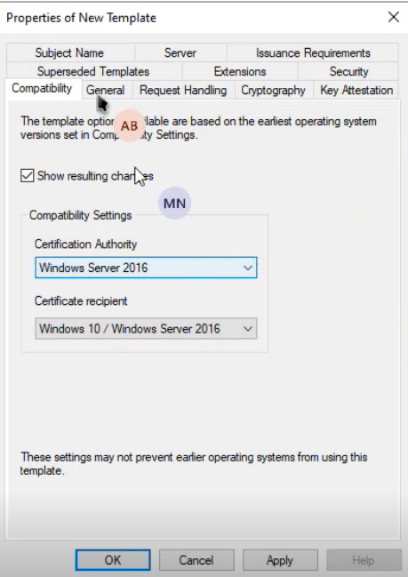
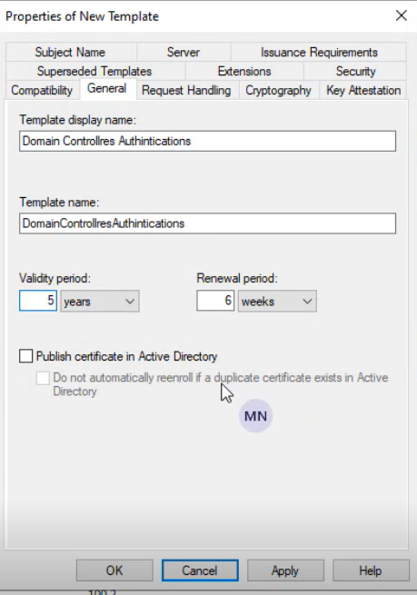
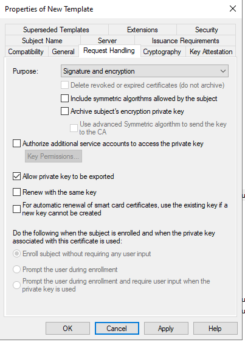
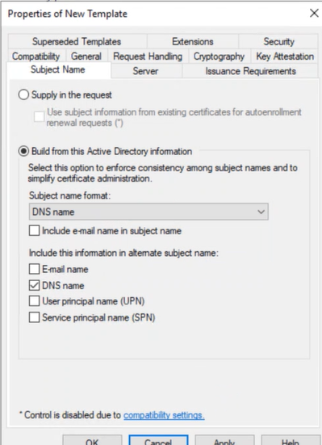
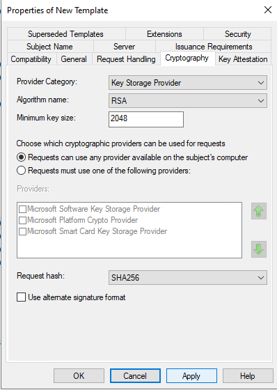
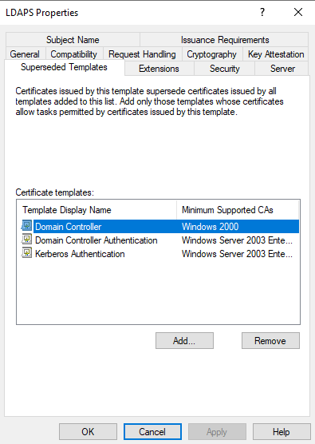
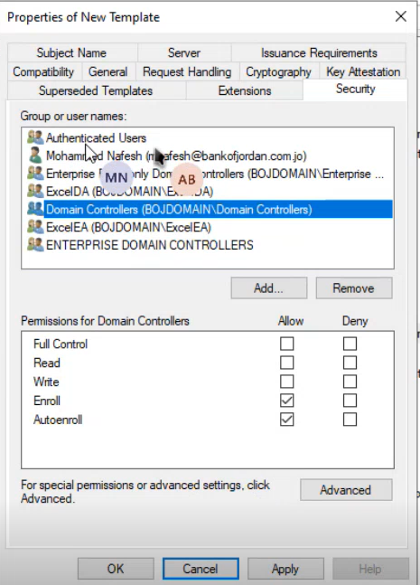
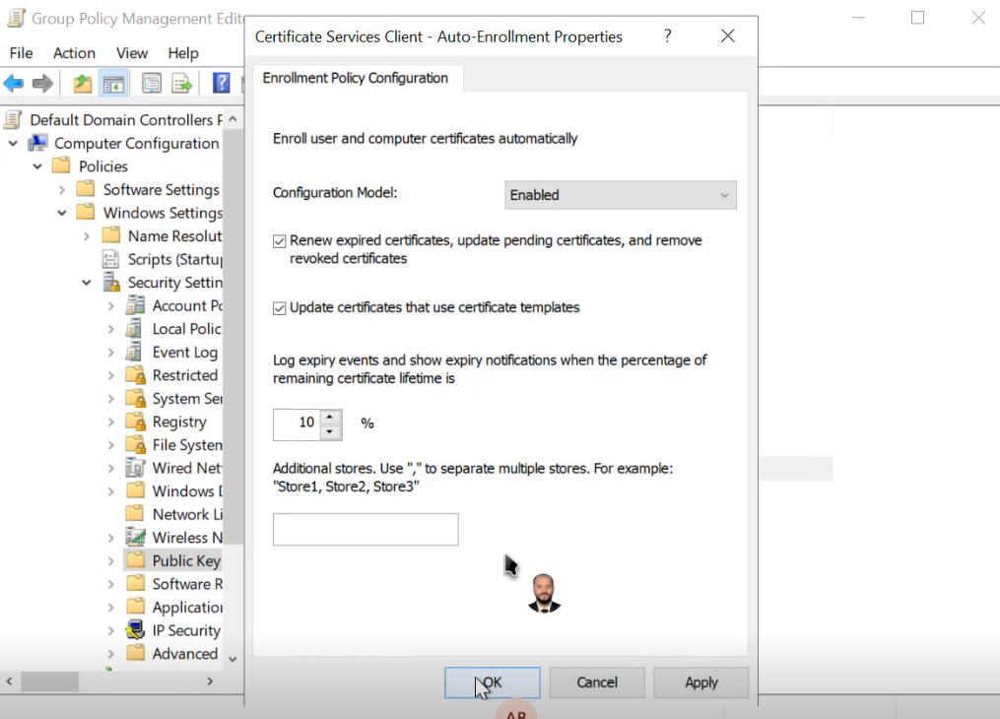

The Certificate to be used for LDAPS must satisfy the following 3 requirements:  
• Certificate must be valid for the purpose of Server Authentication. This means that it must also contains the Server Authentication object identifier (OID): 1.3.6.1.5.5.7.3.1  
• The Subject name or the first name in the Subject Alternative Name (SAN) must match the Fully Qualified Domain Name (FQDN) of the host machine, such as Subject:CN=contosoldaps. For more information, see [How to add a Subject Alternative Name to a secure LDAP certificate](http://support.microsoft.com/kb/931351 "Explains adding a SAN to a LDAPS certificate"). 
• The host machine account must have access to the private key.

To issue New CA follow this steps:
Best source--> [LDAP over SSL (LDAPS) Certificate | Microsoft Learn](https://learn.microsoft.com/en-us/archive/technet-wiki/2980.ldap-over-ssl-ldaps-certificate)
[Configure LDAPS | Setup LDAPS | LDAPS on Windows Server](https://www.miniorange.com/guide-to-setup-ldaps-on-windows-server#step1_2)

- Go to **Windows Key+R** and run **certtmpl.msc** command and choose the **Kerberos Authentication** Template.
- dublicate template
- - Go to **Start -> Certification Authority** Right click on **"Certificate Templates"** and select **New-> Certificate Template to Issue**.
- issue template

- - Go to **Windows Key+R -> mmc -> File -> Add/Remove snap-in**. Select **Certificates**, and click on **Add** button and then click on **Ok** button .
- - Now, right Click on **Certificates** select **All Tasks** and click on **Request for new Certificate**.

gpupdate after issue cert

ensure auto enroll on dc gpo

