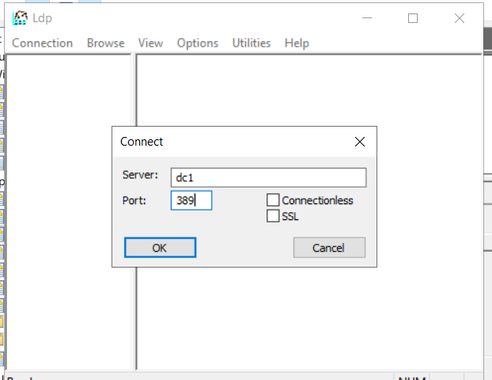
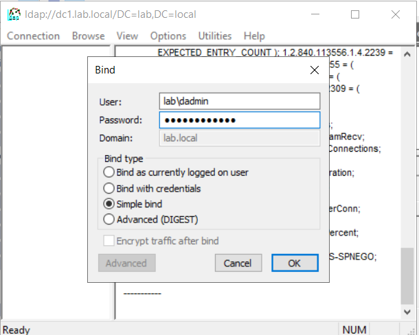
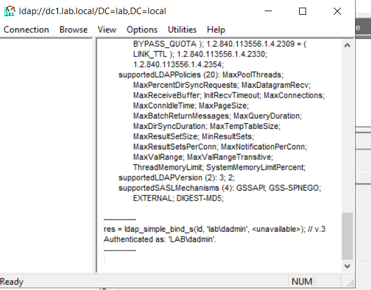
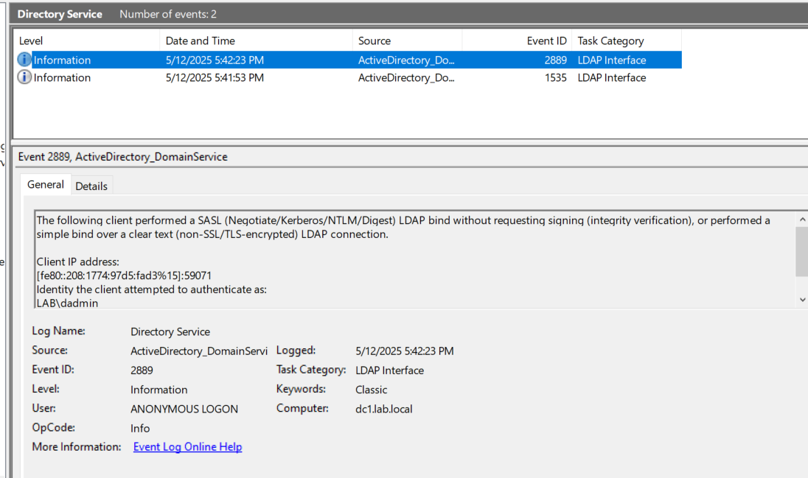

Use LDP to connect to the DC on port 389 (LDAP, not 636 for LDAPS) and perform a simple bind. This should trigger an insecure bind, and event 2889 should now appear in the Directory Service log.

