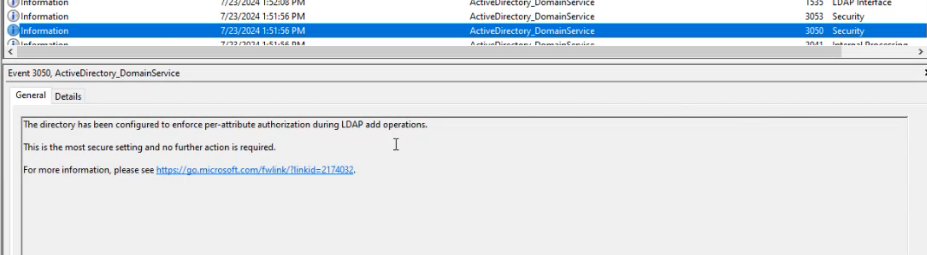
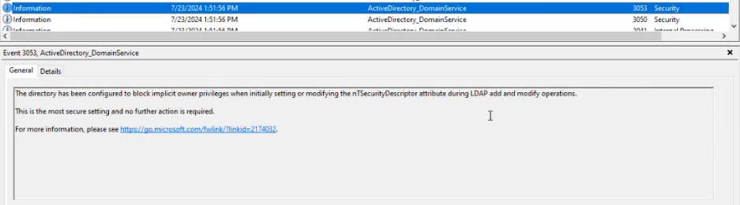

We need to change **dSHeuristics** attribute value:
1. Open ADSI Editor
2. Connect to Configurations 
3. Navigate to `Configuration > Services > Windows NT > Directory Service`
4. Open `Properties > Attribute Editor` and find `dSHeuristics`  attribute
5. Set the value to `00000000010000000002000000011`

Confirm with event 3050 & 3053

[KB5008383—Active Directory permissions updates (CVE-2021-42291) - Microsoft Support](https://support.microsoft.com/en-au/topic/kb5008383-active-directory-permissions-updates-cve-2021-42291-536d5555-ffba-4248-a60e-d6cbc849cde1)
