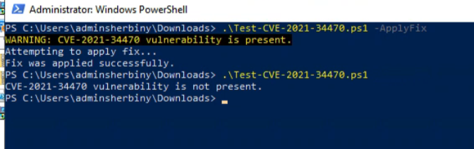

This vulnerability occurs because Exchange adds certain attributes to the schema, and some of these attributes are inherently vulnerable.

CVE-2021-34470

**Note**: This vulnerability **will not be mitigated** by uninstalling Exchange, as the affected attributes remain in the Active Directory schema. To fully address the issue, you need to **modify the schema** to remove or properly secure these vulnerable attributes.

Environments running supported versions of Exchange Server should address CVE-2021-34470 by applying the CU and/or SU for the respective versions of Exchange, as described in [Released: July 2021 Exchange Server Security Updates](https://techcommunity.microsoft.com/t5/exchange-team-blog/released-july-2021-exchange-server-security-updates/ba-p/2523421).

**How to Fix:**

Environments where the latest version of Exchange Server is any version before Exchange 2013, or environments where all Exchange servers have been removed, can use this script to address the vulnerability:

**Resources:**
[How to update AD schema to address CVE-2021-34470 if Exchange is very old or no longer installed | Microsoft Community Hub](https://techcommunity.microsoft.com/blog/exchange/how-to-update-ad-schema-to-address-cve-2021-34470-if-exchange-is-very-old-or-no-/2617083)
[Test-CVE-2021-34470 - Microsoft - CSS-Exchange](https://microsoft.github.io/CSS-Exchange/Security/Test-CVE-2021-34470/)
[Update AD schema to address CVE-2021-34470 vulnerability - ALI TAJRAN](https://www.alitajran.com/cve-2021-34470-vulnerability/)
